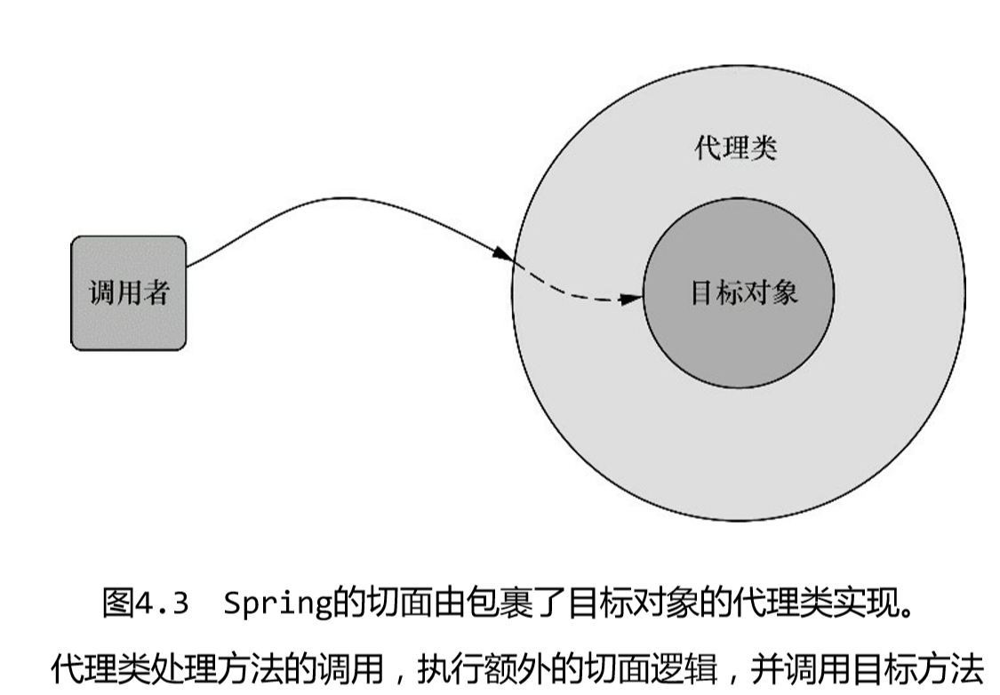

# 面向切面编程

## 概念

横切关注点：

- 在软件开发中，散布于应用中多处的功能叫做横切关注点（cross-cutting concern）；
- 这些横切关注点从概念上是与应用的业务逻辑相分离的 （但是往往会直接嵌入到应用的业务逻辑之中），比如日志、安全、事务等；

面向切面编程（AOP）：

- 取代继承与委托，实现功能的重用；
- 面向横切关注点；

AOP术语：

- 通知（Advice）：通知定义了切面是什么以及何时使用，分类：
  - 前置通知（Before）：在目标方法被调用之前调用通知功能； 
  - 后置通知（After）：在目标方法完成之后调用通知，此时不会关心方法的输出是什么； 
  - 返回通知（After-returning）：在目标方法成功执行之后调用通知； 
  - 异常通知（After-throwing）：在目标方法抛出异常后调用通知；
  - 环绕通知（Around）：通知包裹了被通知的方法，在被通知的方法调用之前和调用之后执行自定义的行为； 
- 连接点（Join Point）：连接点是在应用执行过程中能够插入切面的一个点。这个点可以是调用方法时、抛出异常时、甚至修改一个字段时。
- 切点（PointCut）：切点的定义会匹配通知所要织入的一个或多个连接点。
- 切面（Aspect）：切面是通知和切点的结合。通知和切点共同定义了切面的全部内容——它是什么， 在何时和何处完成其功能。
- 引入（Introduction）：引入允许我们向现有的类添加新方法或属性。
- 织入（Weaving）：织入是把切面应用到目标对象并创建新的代理对象的过程。切面在指定的连接点被 织入到目标对象中。在目标对象的生命周期里有多个点可以进行织入：
  - 编译期：切面在目标类编译时被织入。这种方式需要特殊的编译器。AspectJ 的织入编译器就是以这种方式织入切面的。
  - 类加载期：切面在目标类加载到JVM时被织入。这种方式需要特殊的类加载器（ClassLoader），它可以在目标类被引入应用之前增强该目标类的字节码。 AspectJ 5的加载时织入（load-time weaving，LTW）就支持以这种方式织入切面。
  - 运行期：切面在应用运行的某个时刻被织入。一般情况下，在织入切面时，AOP 容器会为目标对象动态地创建一个代理对象。Spring AOP就是以这种方式织入切面的。 

## Spring AOP

### Spring支持4种类型的AOP支持

- 基于代理的经典Spring AOP； 
- 纯POJO切面； 
- @AspectJ注解驱动的切面； 
- 注入式AspectJ切面（适用于Spring各版本）。

### Spring在运行时通知对象

> 通过在代理类中包裹切面，Spring在运行期把切面织入到Spring管理的bean中。如图4.3所示，代理类封装了目标类，并拦截被通知方法的调用，再把调用转发给真正的目标bean。当代理拦截到方法调用时，在调用目标bean方法之前，会执行切面逻辑。
>
> 直到应用需要被代理的bean时，Spring才创建代理对象。如果使用的是ApplicationContext的话，在ApplicationContext从BeanFactory中加载所有bean的时候，Spring才会创建被代理的对象。因为Spring运行时才创建代理对象，所以我们不需要特殊的编译器来织入Spring AOP的切面。



### Spring只支持方法级别的连接点

> 正如前面所探讨过的，通过使用各种AOP方案可以支持多种连接点模型。因为Spring基于动态代理，所以Spring只支持方法连接点。这与一些其他的AOP框架是不同的，例如AspectJ和JBoss，除了方法切点，它们还提供了字段和构造器接入点。Spring缺少对字段连接点的支持，无法让我们创建细粒度的通知，例如拦截对象字段的修改。而且它不支持构造器连接点，我们就无法在bean创建时应用通知。
>
> 但是方法拦截可以满足绝大部分的需求。如果需要方法拦截之外的连接点拦截功能，那么我们可以利用Aspect来补充Spring AOP的功能。

### 通过切点来选择连接点

切点用于准确定位应该在什么地方应用切面的通知。通知和切点是切面的最基本元素。因此，了解如何编写切点非常重要。在Spring AOP中，要使用AspectJ的切点表达式语言来定义切点。

Spring支持的AspectJ切点指示器（pointcut designator）的一个子集，如下所示：

- arg()：限制连接点匹配参数为指定类型的执行方法 ；
- args()：限制连接点匹配参数由指定注解标注的执行方法 ;
- excution()：用于匹配是连接点的执行方法 ；
- this()：限制连接点匹配AOP代理的bean引用为指定类型的类；
- target：限制连接点匹配目标对象为指定类型的类 ；
- @target()：限制连接点匹配特定的执行对象，这些对象对应的类要具有指定类型的注解；
- within()：限制连接点匹配指定的类型；
- @within()：限制连接点匹配指定注解所标注的类型（当使用Spring AOP时，方法定义在由指定的注解所标注的类里） ；
- @annotation：限定匹配带有指定注解的连接点 ；

在Spring中尝试使用AspectJ其他指示器时，将会抛出IllegalArgument-Exception异常。

从上面指示器可以看出：excution时实际执行匹配的，而其他均为限制匹配的。

### 切点表达式详解

#### execution

由于Spring切面粒度最小是达到方法级别，而execution表达式可以用于明确指定方法返回类型，类名，方法名和参数名等与方法相关的部件，并且在Spring中，大部分需要使用AOP的业务场景也只需要达到方法级别即可，因而execution表达式的使用是最为广泛的。

```java
execution(modifiers-pattern? ret-type-pattern declaring-type-pattern?name-pattern(param-pattern) throws-pattern?)
```

各项语义（？结尾的表示该参数非必须）：

- modifiers-pattern：方法的可见性，如public，protected；
- ret-type-pattern：方法的返回值类型，如int，void等；
- declaring-type-pattern：方法所在类的全路径名，如com.spring.Aspect；
- name-pattern：方法名类型，如buisinessService()；
- param-pattern：方法的参数类型，如java.lang.String；
- throws-pattern：方法抛出的异常类型，如java.lang.Exception；

通配符：

- *：匹配单个单词，或者以某个词为前缀、后缀；
- `..`：匹配0或多个项，主要用于declaring-type-pattern和param-pattern中，如果用于declaring-type-pattern中，则表示匹配当前包及其子包，如果用于param-pattern中，则表示匹配0个或多个参数；

示例：

```java
// 匹配返回值任意，org.example.TestGetUser中，无参数的方法
execution(* org.example.TestGetUser.*())

// 匹配返回值任意，org.example包下以Test开头的类中参数数量不限的方法
execution(* org.example.Test*.*(..))
```

#### within

within表达式的粒度为类，其参数为全路径的类名（可使用通配符），表示匹配当前表达式的所有类都将被当前方法环绕：

```java
within(declaring-type-pattern)
```

-  within表达式只能指定到类级别，如下示例表示匹配org.example.TestGetUser中的所有方法：`within(org.example.TestGetUser)`
-  within表达式路径和类名都可以使用通配符进行匹配。

#### args

args表达式的作用是匹配指定参数类型和指定参数数量的方法，无论其类路径或者是方法名是什么。这里需要注意的是，args指定的参数必须是全路径的。如下是args表达式的语法：

```java
args(param-pattern)
```

`args(java.lang.String)`：匹配只有一个参数，且参数类型是java.lang.String类型的方法；

可以使用通配符`..`，不支持*。示例：

`args(java.lang.String,..,java.lang.Integer)`：切点表达式将匹配第一个参数为java.lang.String，最后一个参数为java.lang.Integer，并且中间可以有任意个数和类型参数的方法。

#### this和target

this和target表达式中都只能指定类或者接口，在面向切面编程规范中，this表示匹配调用当前切点表达式所指代对象方法的对象，target表示匹配切点表达式指定类型的对象。

示例：存在类A和类B，A调用了B的某个方法。如果切点表达式为this(B)，那么A的实例将会被匹配，也即其会被使用当前切点表达式的Advice环绕；如果这里切点表达式为target(B)，那么B的实例也即被匹配，其将会被使用当前切点表达式的Advice环绕。

业务对象（目标对象）和代理对象：对于切面编程，有一个目标对象，也有一个代理对象，目标对象是我们声明的业务逻辑对象，而代理对象是使用切面逻辑对业务逻辑进行包裹之后生成的对象。如果使用的是Jdk动态代理，那么业务对象和代理对象将是两个对象，在调用代理对象逻辑时，其切面逻辑中会调用目标对象的逻辑；如果使用的是Cglib代理，由于是使用的子类进行切面逻辑织入的，那么只有一个对象，即织入了代理逻辑的业务类的子类对象，此时是不会生成业务类的对象的。

在Spring中，其对this的语义进行了改写，即如果当前对象生成的代理对象符合this指定的类型，那么就为其织入切面逻辑。简单的说就是，this将匹配代理对象为指定类型的类。target的语义则没有发生变化，即其将匹配业务对象为指定类型的类。

Spring使用的代理方式主要有两种：Jdk代理和Cglib代理。

- 如果目标对象被代理的方法是其实现的某个接口的方法，那么将会使用Jdk代理生成代理对象，此时代理对象和目标对象是两个对象，并且都实现了该接口；
- 如果目标对象是一个类，并且其没有实现任意接口，那么将会使用Cglib代理生成代理对象，并且只会生成一个对象，即Cglib生成的代理类的对象。

解合上面两点，理解this与target的区别：

- this(SomeInterface)或target(SomeInterface)：这种情况下，无论是对于Jdk代理还是Cglib代理，其目标对象和代理对象都是实现SomeInterface接口的（Cglib生成的目标对象的子类也是实现了SomeInterface接口的），因而this和target语义都是符合的，此时这两个表达式的效果一样；
- this(SomeObject)或target(SomeObject)，这里SomeObject没实现任何接口：这种情况下，Spring会使用Cglib代理生成SomeObject的代理类对象，由于代理类是SomeObject的子类，子类的对象也是符合SomeObject类型的，因而this将会被匹配，而对于target，由于目标对象本身就是SomeObject类型，因而这两个表达式的效果一样；
- this(SomeObject)或target(SomeObject)，这里SomeObject实现了某个接口：对于这种情况，虽然表达式中指定的是一种具体的对象类型，但由于其实现了某个接口，因而Spring默认会使用Jdk代理为其生成代理对象，Jdk代理生成的代理对象与目标对象实现的是同一个接口，但代理对象与目标对象还是不同的对象，由于代理对象不是SomeObject类型的，因而此时是不符合this语义的，而由于目标对象就是SomeObject类型，因而target语义是符合的，此时this和target的效果就产生了区别；这里如果强制Spring使用Cglib代理，因而生成的代理对象都是SomeObject子类的对象，其是SomeObject类型的，因而this和target的语义都符合，其效果就是一致的。

测试异同：

```java
// 目标类
public class TargetClass {
    public void test(){
        System.out.println("TargetClass.test method invoked!");
    }
}
public class TestClass {
    public void test(){
        System.out.println("TargetClass.test method invoked!");
    }
}
// 测试切面
@Aspect
public class TestAspect {
    @Around("target(org.example.test.TargetClass)")
    public Object around(ProceedingJoinPoint pjp) throws Throwable {
        System.out.println("this is before around advice");
        Object result = pjp.proceed();
        System.out.println("this is after around advice");
        return result;
    }
    @Around("this(org.example.test.TestClass)")
    public Object aroundTest(ProceedingJoinPoint pjp) throws Throwable {
        System.out.println("this is before around advice");
        Object result = pjp.proceed();
        System.out.println("this is after around advice");
        return result;
    }
}
// JavaConfig
@Configuration
@ComponentScan(basePackages = "org.example.test")
@EnableAspectJAutoProxy
public class TestConfig {
    @Bean
    public TargetClass targetClass(){
        return new TargetClass();
    }
    @Bean
    public TestAspect testAspect(){
        return new TestAspect();
    }
    @Bean
    public TestClass testClass(){
        return new TestClass();
    }
}
// 测试类
public class TestApplication {
    public static void main(String[] args) {
        ApplicationContext context=new
                AnnotationConfigApplicationContext(TestConfig.class);
        TargetClass target=context.getBean(TargetClass.class);
        target.test();
        TestClass test=context.getBean(TestClass.class);
        test.test();
    }
}
// 输出：
this is before around advice
TargetClass.test method invoked!
this is after around advice
this is before around advice
TargetClass.test method invoked!
this is after around advice
```

上述示例中，TestClass与TargetClass没有实现任何接口，因而使用的是Cglib代理，this表达式会匹配TestClass对象，对于target，由于目标对象本身就是TargetClass类型，会匹配。

对目标类进行调整，使其实现接口：

```java
// 接口
public interface TestInter {
    public void test();
}

public class TargetClass implements TestInter{
    public void test(){
        System.out.println("TargetClass.test method invoked!");
    }
}
```

输出：

使用this时：TargetClass.test method invoked!

使用target时：

this is before around advice
TargetClass.test method invoked!
this is after around advice

注意事项：在使用接口时，不能同时有两个实现类，否则会出现使用实现类获取不到bean，而使用接口则会获得两个bean。这是因为Spring有两种代理方式：Jdk代理和Cglib代理。使用jdk代理时：是通过jdk直接生成动态代理类（通过接口注入）；使用Cglib时去实现接口，直接使用代理类，而不能实现接口。

#### @within

@within表示匹配带有指定注解的类：`@within(annotation-type)`

测试：

```java
// 自定义注解
@Target({ElementType.METHOD,ElementType.TYPE})
@Retention(RetentionPolicy.RUNTIME)
@Documented
public @interface TestInter {
}
// 目标类
@Component
@TestInter
public class TestClass {

    public void test(){
        System.out.println("Test!");
    }
}
// 切面
@Aspect
@Component
public class TestAspect {
    // 全路径
    // @Within只能接受注解在类上
    @Around("@within(TestInter)")
    public void round(ProceedingJoinPoint joinPoint){
        try {
            System.out.println("前置方法！");
            joinPoint.proceed();
            System.out.println("后置方法");
        } catch (Throwable throwable) {
            throwable.printStackTrace();
        }
    }
}
// 配置类(自动配置)
@Configuration
@ComponentScan(basePackages = "org.example.testAnnotation")
@EnableAspectJAutoProxy
public class TestConfig {
}
// 测试
public class TestApplication {
    public static void main(String[] args) {
        ApplicationContext context=new
                AnnotationConfigApplicationContext(TestConfig.class);
        TestClass test=context.getBean(TestClass.class);
        test.test();
    }
}
```

#### @annotation

@annotation的使用方式与@within的相似，表示匹配使用@annotation指定注解标注的方法将会被环绕；

#### @args

@within和@annotation分别表示匹配使用指定注解标注的类和标注的方法将会被匹配，@args则表示使用指定注解标注的类作为某个方法的参数时该方法将会被匹配。如下是@args注解的语法：

```java
@args(annotation-type)
```

#### @DeclareParents

@DeclareParents也称为Introduction（引入），表示为指定的目标类引入新的属性和方法。关于@DeclareParents的原理其实比较好理解，因为无论是Jdk代理还是Cglib代理，想要引入新的方法，只需要通过一定的方式将新声明的方法织入到代理类中即可，因为代理类都是新生成的类，因而织入过程也比较方便。如下是@DeclareParents的使用语法：

```java
@DeclareParents(value = "TargetType", defaultImpl = WeaverType.class)
private WeaverInterface attribute;
```

### 编写切点

定义一个主题接口Performance：

```java
package org.example;

public interface Performance{
    public void perform();
}
```

编写Performance的perform()方法触发的通知，切点表达式如下：

```
execution(* org.example.Performance.perform(..))

- execution:方法执行时触发
- *:返回任意类型
- ..:使用任意参数


// 仅匹配org.example包
execution(* org.example.Performance.perform(..)) && within(org.example.*)

- &&:操作符把execution()和within()指示器连接在一起形成与 （and）关系（切点必须匹配所有的指示器）,类似地，我们可以使用“||”操作符 来标识或（or）关系，而使用“!”操作符来标识非（not）操作。&&、||、!可以用and、or、not代替。


// 在切点中选择bean：Spring还引入了一个新的bean()指示器，它允许我们在切点表达式中使用bean的ID来标识bean。bean()使用bean ID或bean名称作为参数来限制切点只匹配特定的bean。
execution(* org.example.Performance.perform(..)) and bean('woodstock')

- 在执行Performance的perform()方法时应用通知，但限定bean的ID为woodstock。
- 除了限定切点为指定的bean，还可以使用非操作为除了特定ID以外的其他bean应用通知：
execution(* org.example.Performance.perform(..)) and !bean('woodstock')
```

### 使用注解创建切面

#### 定义切面

```java
// 表明该pojo是一个切面
@Aspect
public class Audience {
    @Before("execution(* org.example.inter.Performance.perform(..))")
    public void before(){
        System.out.println("表演之前");
    }
    @Before("execution(* org.example.inter.Performance.perform(..))")
    public void before1(){
        System.out.println("表演之前1");
    }
    @After("execution(* org.example.inter.Performance.perform(..))")
    public void after(){
        System.out.println("表演结束");
    }
    @AfterThrowing("execution(* org.example.inter.Performance.perform(..))")
    public void afterException(){
        System.out.println("表演异常结束");
    }
}
```

AspectJ 提供了五个注解来定义通知：

-  @After：通知方法会在目标方法返回或抛出异常后调用；
-  @AfterReturning：通知方法会在目标方法返回后调用 ；
- @AfterThrowing：通知方法会在目标方法抛出异常后调用 ；
- @Around：通知方法会将目标方法封装起来 ；
- @Before：通知方法会在目标方法调用之前执行 

@Pointcut注解能够在一个@AspectJ切面内定义可重用的切点：

```java
@Pointcut("execution(* org.example.inter.Performance.perform(..))")
public void performance(){}

@Before("performance()")
public void before(){
    System.out.println("表演之前");
}
```

#### 配置

在JavaConfig配置类中进行配置，并且通过注解@EnableAspectJAutoProxy开启自动代理功能：

```java
@Configuration
@EnableAspectJAutoProxy
public class MyConfiguration {
    @Bean
    public Audience audience(){
        return new Audience();
    }
}
```

使用xml来装配：

```xml
<aop:aspectj-autoproxy/>
<bean class="org.example.aop.Audience"/>
```

Spring的AspectJ自动代理仅仅使用@AspectJ作为创建切面的指导，切面依然是基于代理的。在本质上，它依然是Spring基于代理的切面。这一点非常重要，因为这意味着尽管使用的是@AspectJ注解，但我们仍然限于代理方法的调用。如果想利用AspectJ的所有能力，我们必须在运行时使用AspectJ并且不依赖 Spring来创建基于代理的切面。

#### 环绕通知

使用环绕通知重新实现Audience切面：

```java
@Around("performance()")
public void round(ProceedingJoinPoint joinPoint){
    try {
        System.out.println("表演开始之前");
        joinPoint.proceed();
        System.out.println("表演开始之后");
    } catch (Throwable throwable) {
        throwable.printStackTrace();
    }
}
```

ProceedingJoinPoint：在通知中通过它来调用被通知的方法。通知方法中可以做任何的事情，当要将控制权交给被通知的方法时，它需要调用ProceedingJoinPoint的proceed()方法。

#### 处理通知中的参数

当切面通知的方法中存在参数时，切面如何访问和使用被传递给通知的方法的参数？

示例：

```java
// 带参数
public class TestClass {
    public void test(String name){
        System.out.println("TargetClass.test method invoked!"+name);
    }
}
// 切面写法：在execution指定参数类型，在args中指定参数名
@Around("execution(* org.example.test.TestClass.test(java.lang.String)) && args(name)")
public Object aroundTest(ProceedingJoinPoint pjp,String name) throws Throwable {
    System.out.println("this is before around advice"+name);
    Object result = pjp.proceed();
    System.out.println("this is after around advice"+name);
    return result;
}
// 配置类+测试
```

#### 通过注解引入新功能


@DeclareParents注解：

- value属性指定了哪种类型的bean要引入该接口；
- defaultImpl属性指定了为引入功能提供实现的类；
- @DeclareParents注解所标注的静态属性指明了要引入了接口；

### 在xml中声明切面

在spring的命名空间中，提供了多个元素用来在xml中声明切面：

- `<aop:advisor>`：定义AOP通知器 
- `<aop:after>`：定义AOP后置通知（不管被通知的方法是否执行成功） 
- `<aop:after-returning>`：定义AOP返回通知 
-  `<aop:after-throwing>`：定义AOP异常通知 
-  `<aop:around>`：定义AOP环绕通知 

-  `<aop:aspect>`：定义一个切面 

-  `<aop:aspectj-autoproxy>`：启用 @AspectJ注解驱动的切面

-  `<aop:before>`：定义一个AOP前置通知 

- `<aop:config>`：顶层的AOP配置元素。大多数的 `<aop:*>`元素必须包含在`<aop:config>`元素内

-  `<aop:declare-parents>`：以透明的方式为被通知的对象引入额外的接口 

- `<aop:pointcut>`：定义一个切点 

在xml中进行配置：

```java
public class Audience{
    public void before(){
        System.out.println("Before!");
    }
    public void after(){
        System.out.println("Before!");
    }
    public void throw(){
        System.out.println("Before!");
    }
}
```

xml配置：

```xml
<bean id="audience" class="org.example.Audience"></bean>
<aop:config>    
    <!-- 引用audience bean -->
	<aop:aspect ref="audience">
        <!--自定义切点-->
        <aop:pointcut id="cut" expression=""/>
        
        <aop:before pointcut-ref="cut" method="before"/>
        <aop:after pointcut="" method="after"/>
        <aop:after-throwing pointcut="" method="throw"/>
    </aop:aspect>
    
    <aop:aspect ref="audience">
        <!--自定义切点-->
        <aop:pointcut id="cut1" expression=""/>
        
        <aop:around pointcut-ref="cut" method="around"/>
    </aop:aspect>
</aop:config>
```

引入新功能`<aop:declare-parents>`：

```xml
<aop:aspect>
	<aop:declare-parents
        types-matching=""
        implement-interface=""
        default-impl=""/>
</aop:aspect>
```

