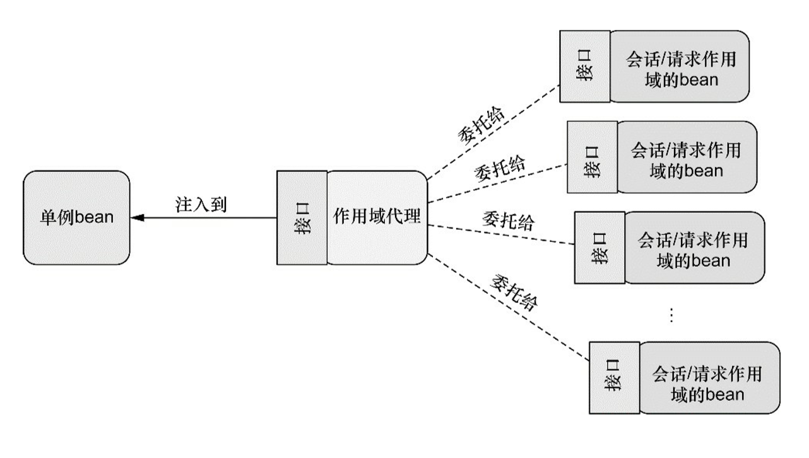

# 高级装配

## profile bean

要使用profile，你首先要将所有不同的bean定义整理到一个或多个profile之中，在将应用部署到每个环境 时，要确保对应的profile处于激活（active）的状态。
在Java配置中，可以使用@Profile注解指定某个bean属于哪一个profile。

- JavaConfig：支持在配置类（@Configuration注解的类）和配置类的方法上使用@Profile注解。
- XML文件：通过`<beans>`的profile属性设置环境。可以在根`<beans>`或嵌套的`<beans> <beans profile="dev"></beans><beans profile="prod"></beans></beans>`中进行设置；

**激活profiles**

spring在确定哪个profile处于激活状态，依赖两个独立属性：spring.profiles.active和spring.profiles.default。

- 如果设置了 spring.profiles.active属性的话，那么它的值就会用来确定哪个profile是激活的。
- 但如果没有设置spring.profiles.active属性的话，那Spring将会查找spring.profiles.default的值。
- 如果spring.profiles.active和 spring.profiles.default均没有设置的话，那就没有激活的profile，因此只会创建那些没有定义在profile中的bean。

设置这两个属性的方式：

- 作为DispatcherServlet的初始化参数； 
- 作为Web应用的上下文参数； 
- 作为JNDI条目； 
- 作为环境变量； 
- 作为JVM的系统属性； 
- 在集成测试类上，使用@ActiveProfiles注解设置。

例如，在web应用的上下文参数设置默认的profile：可以设置多个，用“，”隔开

```xml
<!-- web.xml -->
<web-app ....>
    <context-param>
        <param-name>contextConfigLocation</param-name>
        <param-value>
            /WEB-INF/spring/root-context.xml
        </param-value>
    </context-param>
    <!-- 为上下文设置默认的profile -->
    <context-param>
        <param-name>spring.profiles.default</param-name>
        <param-value>dev</param-value>
    </context-param>
    
    <servlet>
    	<servlet-name>appServlet</servlet-name>
        <servlet-value>
            org.springframework.web.servlet.DispatcherServlet
        </servlet-value>
        <init-param>
            <!-- 为Servlet设置默认的profile -->
        	<param-name>spring.profiles.default</param-name>
            <param-value>dev</param-value>
        </init-param>
        <load-on-startup>1</load-on-startup>
    </servlet>
</web-app>
```

## 条件化的bean

假设你希望一个或多个bean只有在应用的类路径下包含特定的库时才创建。或者我们希望某个bean只有当另外某个特定的bean也声明了之后才会创建。我们还可能要求只有某个特定的环境变量设置之后，才会创建某个bean。

Spring 4引入了一个新的 @Conditional注解，它可以用到带有@Bean注解的方法上。如果给定的条件计算结果为true，就会创建这个bean，否则的话，这个bean会被忽略。

@Conditional(xx.class)：会通过Condition接口进行条件对比（xx.class可以是任意实现了Condition接口的类型，只需要实现matches方法即可）：

```java
public interface Condition {
    boolean matches(ConditionContext var1, 
                    AnnotatedTypeMetadata var2);
}
```

ConditionContext是一个接口：

```java
public interface ConditionContext {
    // 返回BeanDefinitionRegistry：可以检查bean定义
    BeanDefinitionRegistry getRegistry();
	// 返回ConfigurableListableBeanFactory：可以检查bean是否存在，
    //  甚至探查bean的属性； 
    ConfigurableListableBeanFactory getBeanFactory();
	// 返回Environment：检查环境变量是否存在以及它的值是什么
    Environment getEnvironment();
	// 返回ResourceLoader：读取并探查ResourceLoader所加载的资源
    ResourceLoader getResourceLoader();
	// 返回ClassLoader：可以加载并检查类是否存在
    ClassLoader getClassLoader();
}
```

AnnotatedTypeMetadata则能够让我们检查带有@Bean注解的方法上还有什么其他的注解：

```java
public interface AnnotatedTypeMetadata {
    boolean isAnnotated(String var1);
    Map<String, Object> getAnnotationAttributes(String var1);
    Map<String, Object> getAnnotationAttributes(String var1, boolean var2);
    MultiValueMap<String, Object> getAllAnnotationAttributes(String var1);
    MultiValueMap<String, Object> getAllAnnotationAttributes(String var1, boolean var2);
}
```

Spring 4中@Profile注解进行了重构，基于@Conditional和@Condition实现。

例：有一个Student类，我们希望只有容器中存在Teacher类时才创建，代码如下：

```java
// Student类
@Component
public class Student {
    @Value("张三")
    private String name;
    @Value("19")
    private int age;
    --- 省略了构造方法和setter/getter----
}

// Teacher类
@Component
public class Teacher {
    private String name;
    private int age;
    --- 省略了构造方法和setter/getter----
}

// 条件配置类
import org.springframework.beans.factory.config.ConfigurableListableBeanFactory;
import org.springframework.context.annotation.Condition;
import org.springframework.context.annotation.ConditionContext;
import org.springframework.core.type.AnnotatedTypeMetadata;

public class StudentCondition implements Condition {
    @Override
    public boolean matches(ConditionContext conditionContext,
                           AnnotatedTypeMetadata annotatedTypeMetadata) {
        ConfigurableListableBeanFactory factory=conditionContext
                .getBeanFactory();
        return factory.containsBeanDefinition("teacher");
    }
}

// 配置类
@Configuration
public class MyConfig {
    private String name="李四";
    private int age=18;
    @Bean
    public Teacher teacher(){
        return new Teacher(name,age);
    }
    
    @Bean
    @Conditional(StudentCondition.class)
    public Student student(){
        return new Student();
    }
}
```

## 处理装配的歧义性

自动装配能够让spring完全负责将bean引用注入到 构造参数和属性中，不过，仅有一个bean匹配所需的结果时，自动装配才是有效的。如果不仅有一个 bean能够匹配结果的话，这种歧义性会阻碍Spring自动装配属性、构造器参数或方法参数。

比如一个接口ICar以及三个实现类Car、Bicycle、Bus，和使用ICar接口的Driver类，在如下的自动装配中会出错：

```java
public class Driver{
    private ICar car;
    
    @Autowired
    public void setCar(Icar car){
        this.car=car;
    }
}
```

解决办法：

1. 标识首选的bean：

   - 自动配置：

     即在@Component注解的ICar实例上添加@Primary标明首选的Bean（该注解在同一接口的实现类只能标注一个）；

   - JavaConfig显示配置：

     在配置类中相应实例的@Bean注解下添加@Primary注解；

   - xml配置：

     利用bean的primary属性，即 `<bean id="" class="" primary="true">`

2. 限定自动装配的bean：

   - 首选bean局限性：

     - @Primary无法将可选方案的范围限定到唯一一个无歧义性的选项中。
     - 它只能标示一个优先的可选方案。
     - 当首选bean的数量超过一个时，我们 并没有其他的方法进一步缩小可选范围。

   - Spring限定符：@Qualifier注解，可以与@Autowired和@Inject协同使用，声明注入的bean具体是哪一个。

     - 使用Spring自动创建的bean名作为限定符：为@Qualifier注解所设置的参数就是想要注入的 bean的ID。所有使用@Component注解声明的类都会创建为bean，并且bean的ID为首 字母变为小写的类名。

     - 自定义限定符：@Component与@Qualifier("限定符")连用，将bean设置自己的限定符；或在使用Java配置显式定义时，与@Bean连用，设置自己的限定符。

     - 使用自定义的限定符注解：如果多个限定符才能唯一确定bean或不想使用@Qualifer注解的时候，可以自定义注解来代替；

       示例：

       ```java
       import org.springframework.beans.factory.annotation.Qualifier;
       
       import java.lang.annotation.ElementType;
       import java.lang.annotation.Retention;
       import java.lang.annotation.RetentionPolicy;
       import java.lang.annotation.Target;
       
       @Target({ElementType.CONSTRUCTOR,ElementType.FIELD,
               ElementType.METHOD,ElementType.TYPE})
       @Retention(RetentionPolicy.RUNTIME)
       @Qualifier
       public @interface Car {
       }
       ```

## bean的作用域

在默认情况下，Spring应用上下文中所有bean都是作为以单例（singleton）的形式创建的。也就是说，不管给定的一个bean被注入到其他bean多少次，每次所注入的都是同一个实例。

在大多数情况下，单例bean是很理想的方案。初始化和垃圾回收对象实例所带来的成本只留给一些小规模任务，在这些任务中，让对象保持无状态并且在应用中反复重用这些对象可能并不合理。

有时候，可能会发现，你所使用的类是易变的（mutable），它们会保持一些状态，因此重用是不安全的。在这种情况下，将class声明为单例的bean就不是什么好主意了，因为对象会被污染，稍后重用的时候会出现意想不到的问题。

Spring定义了多种作用域，可以基于这些作用域创建bean：

- 单例（Singleton）：在整个应用中，只创建bean的一个实例。 
- 原型（Prototype）：每次注入或者通过Spring应用上下文获取的时候，都会创建一个新的bean实例。
- 会话（Session）：在Web应用中，为每个会话创建一个bean实例。 
- 请求（Rquest）：在Web应用中，为每个请求创建一个bean实例。

需要选择其他的作用域，可以使用@Scope，其可以和@Component、@Bean实例一起使用。

比如：

```java
// 声明组件
@Component
@Scope(ConfigurableBeanFactory.SCOPE_PROTOTYPE)
public class Student{}

// 在配置类中使用
@Bean
@Scope(ConfigurableBeanFactory.SCOPE_PROTOTYPE)
public Student student(){
    return new Student();
}

// 在xml中使用
<bean id="student" class="com.example.Student" scope="prototype"/>
```

示例使用了ConfigurableBeanFactory类的SCOPE_PROTOTYPE常量设置了原型作用域。你当然也可以使用@Scope("prototype")，但是使用SCOPE_PROTOTYPE常量更加安全并且不易出错。

### 使用会话和请求域

在Web应用中，如果能够实例化在会话和请求范围内共享的bean，那将是非常有价值的事情。例如，在典型的电子商务应用中，可能会有一个bean代表用户的购物车。如果购物车是单例的话，那么将会导致所有的用户都会向同一个购物车中添加商品。另一方面，如果购物车是原型作用域的，那么在应用中某一个地方往购物车中添加商品，在应用的另外一个地方可能就不可用了，因为在这里注入的是另外一个原型作用域的购物车。

就购物车bean来说，会话作用域是最为合适的，因为它与给定的用户关联性最大。要指定会话作用域，我们可以使用@Scope注解，它的使用方式与指定原型作用域是相同的：

```java
@Component
@Scope(
	Value=WebApplicationContext.SCOPE_SESSION,
	proxyMode=ScopedProxyMode.INTERFACES)
public ShoppingCart cart(){...}
```

将value设置成了WebApplicationContext中的SCOPE_SESSION常量（它的值是session）。这会告诉Spring为Web应用中的每个会话创建一个ShoppingCart。这会创建多个ShoppingCart bean的实例，但是对于给定的会话只会创建一个实例，在当前会话相关的操作中，这个bean实际上相当于单例的。

@Scope同时还有一个proxyMode属性，它被设置成了ScopedProxyMode.INTERFACES。这个属性解决了将会话或请求作用域的bean注入到单例 bean中所遇到的问题。

**proxyMode所解决问题的场景：**

假设要将ShoppingCart bean注入到单例StoreService bean的Setter方法，而StoreService是一个单例的bean，会在Spring应用上下文加载的时候创建。当它创建的时候，Spring会试图将ShoppingCart bean注入到setShoppingCart()方法中。但是ShoppingCart bean是会话作用域的，此时并不存在。直到某个用户进入系统，创建了会话之后，才会出现ShoppingCart实例。

另外，系统中将会有多个ShoppingCart实例：每个用户一个。我们并不想让Spring注入某个固定的ShoppingCart实例到StoreService中。我们希望的是当StoreService处理购物车功能时，它所使用的ShoppingCart实例恰好是当前会话所对应的那一个。

Spring并不会将实际的ShoppingCart bean注入到StoreService中，Spring会注入一个到ShoppingCart bean的代理，如图3.1所示。这个代理会暴露与ShoppingCart相同的方法，所以StoreService会认为它就是一个购物车。但是，当StoreService调用ShoppingCart的方法时，代理会对其进行懒解析并将调用委托给会话作用域内真正的ShoppingCart bean。

**proxyMode属性：**

如配置所示，proxyMode属性被设置成了ScopedProxyMode.INTERFACES，这表明这个代理要实现ShoppingCart接口，并将调用委托给实现bean。如果ShoppingCart是接口而不是类的话，这是可以的（也是最为理想的代理模式）。 

但如果ShoppingCart是一个具体的类的话，Spring就没有办法创建基于接口的代理了。此时，它必须使用CGLib来生成基于类的代理。所以，如果bean类型是具体类的话，我们必须要将proxyMode属性设置为ScopedProxyMode.TARGET_CLASS，以此来表明要以生成目标类扩展的方式创建代理。

**请求作用域**的bean会面临相同的装配问题。因此，请求作用域的bean应该也以作用域代理的方式进行注入。



### 在xml中声明作用域代理

如果需要使用XML来声明会话或请求作用域的bean，那么就不能使用@Scope注解及其proxyMode属性了。`<bean>`元素的scope属性能够设置bean的作用域，但是该怎样指定代理模式呢？
要设置代理模式，我们需要使用Spring aop命名空间的一个新元素：

```xml
<!--
命名空间：xmlns:aop="http://www.springframework.org/schema/aop"
-->

<bean id="cart"
      class="com.example.ShoppingCart"
      scope="session">
    <!--
	aop:scoped-proxy是与@Scope注解的proxyMode属性功能相同的Spring XML配置元素，
	默认情况下，它会使用CGLib创建目标类的代理。但是我们也可以将proxy-target-class
	属性设置为false，进而要求它生成基于接口的代理。
	-->
	<aop:scoped-proxy />
</bean>
```

## 运行时注入

当讨论依赖注入的时候，我们通常所讨论的是将一个bean引用注入到另一个bean的属性或构造器参数中。它通常来讲指的是将一个对象与另一个对象进行关联。但是bean装配的另外一个方面指的是将一个值注入到bean的属性或者构造器参数中。但这种方式值是硬编码的，为了避免硬编码，spring提供了两种运行时求值方式：

- 属性占位符；
- Spring表达式语言（SpEL）；

### 注入外部值


