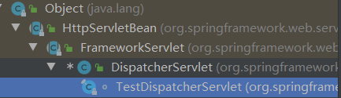

# DispatcherServlet作用

DispatcherServlet是前端控制器设计模式的实现，提供Spring Web MVC的集中访问点，而且负责职责的分派，而且与Spring IoC容器无缝集成，从而可以获得Spring的所有好处。

DispatcherServlet主要用作职责调度工作，本身主要用于控制流程，主要职责如下：

1. 文件上传解析，如果请求类型是multipart将通过MultipartResolver进行文件上传解析；

2. 通过HandlerMapping，将请求映射到处理器（返回一个HandlerExecutionChain，它包括一个处理器、多个HandlerInterceptor拦截器）；

3. 通过HandlerAdapter支持多种类型的处理器(HandlerExecutionChain中的处理器)；

4. 通过ViewResolver解析逻辑视图名到具体视图实现；

5. 本地化解析；

6. 渲染具体的视图等；

7. 如果执行过程中遇到异常将交给HandlerExceptionResolver来解析。

## 配置servlet

在web.xml中配置DispatchServlet：

```xml
<servlet>
    <servlet-name>dispatchServlet</servlet-name>
    <servlet-class>
        org.springframework.web.servlet.DispatcherServlet
    </servlet-class>
    <load-on-startup>1</load-on-startup>
</servlet>
<servlet-mapping>
    <servlet-name>dispatchServlet</servlet-name>
    <url-pattern>/</url-pattern>
</servlet-mapping>
```

- load-on-startup：表示启动容器时初始化该Servlet；

- url-pattern：表示哪些请求交给Spring Web MVC处理，
  - “/” 是用来定义默认servlet映射的。
  - 也可以如“*.html”表示拦截所有以html为扩展名的请求。

该DispatcherServlet默认使用WebApplicationContext作为上下文，Spring默认配置文件为“/WEB-INF/[servlet名字]-servlet.xml”。DispatcherServlet也可以配置自己的初始化参数，覆盖默认配置：

- contextClass：实现WebApplicationContext接口的类，当前的servlet用它来创建上下文。如果这个参数没有指定， 默认使用XmlWebApplicationContext。
- contextConfigLocation：传给上下文实例（由contextClass指定）的字符串，用来指定上下文的位置。这个字符串可以被分成多个字符串（使用逗号作为分隔符） 来支持多个上下文（在多上下文的情况下，如果同一个bean被定义两次，后面一个优先）。
- namespace：WebApplicationContext命名空间。默认值是[server-name]-servlet。

```xml
<servlet>
    <servlet-name>chapter2</servlet-name>
    <servlet-class>
        org.springframework.web.servlet.DispatcherServlet
    </servlet-class>
    <load-on-startup>1</load-on-startup>
    <init-param>
        <param-name>contextConfigLocation</param-name>
        <param-value>classpath:spring-servlet-config.xml</param-value>
    </init-param>
</servlet>
```

如果使用如上配置，Spring Web MVC框架将加载“classpath:spring-servlet-config.xml”来进行初始化上下文而不是“/WEB-INF/[servlet名字]-servlet.xml”。

## 上下文关系

集成web环境的通用配置：

```xml
<context-param>
    <param-name>contextConfigLocation</param-name>
    <param-value>
        classpath:spring-common-config.xml,
        classpath:spring-budget-config.xml
    </param-value>
</context-param>
<listener>  
    <listener-class>
        org.springframework.web.context.ContextLoaderListener
    </listener-class>
</listener>
```

如上配置是Spring集成Web环境的通用配置；一般用于加载除Web层的Bean（如DAO、Service等），以便于与其他任何Web框架集成。

- contextConfigLocation：表示用于加载Bean的配置文件；

- contextClass：表示用于加载Bean的ApplicationContext实现类，默认WebApplicationContext。

创建完毕后会将该上下文放在ServletContext：

servletContext.setAttribute(

WebApplicationContext.ROOT_WEB_APPLICATION_CONTEXT_ATTRIBUTE,

this.context);

ContextLoaderListener初始化的上下文和DispatcherServlet初始化的上下文关系：


从图中可以看出：

- ContextLoaderListener初始化的上下文加载的Bean是对于整个应用程序共享的，不管是使用什么表现层技术，一般如DAO层、Service层Bean；

- DispatcherServlet初始化的上下文加载的Bean是只对Spring Web MVC有效的Bean，如Controller、HandlerMapping、HandlerAdapter等等，该初始化上下文应该只加载Web相关组件。

## DispatcherServlet初始化顺序

继承结构：



1. HttpServletBean继承HttpServlet，因此在Web容器启动时将调用它的init方法，该初始化方法的主要作用：

   - 将Servlet初始化参数（init-param）设置到该组件上（如contextAttribute、contextClass、namespace、contextConfigLocation），通过BeanWrapper简化设值过程，方便后续使用；
   - 提供给子类初始化扩展点，initServletBean()，该方法由FrameworkServlet覆盖。

2. FrameworkServlet继承HttpServletBean，通过initServletBean()进行Web上下文初始化，该方法主要覆盖一下两件事情：

   - 初始化web上下文；

   - 提供给子类初始化扩展点；

3. DispatcherServlet继承FrameworkServlet，并实现了onRefresh()方法提供一些前端控制器相关的配置：

