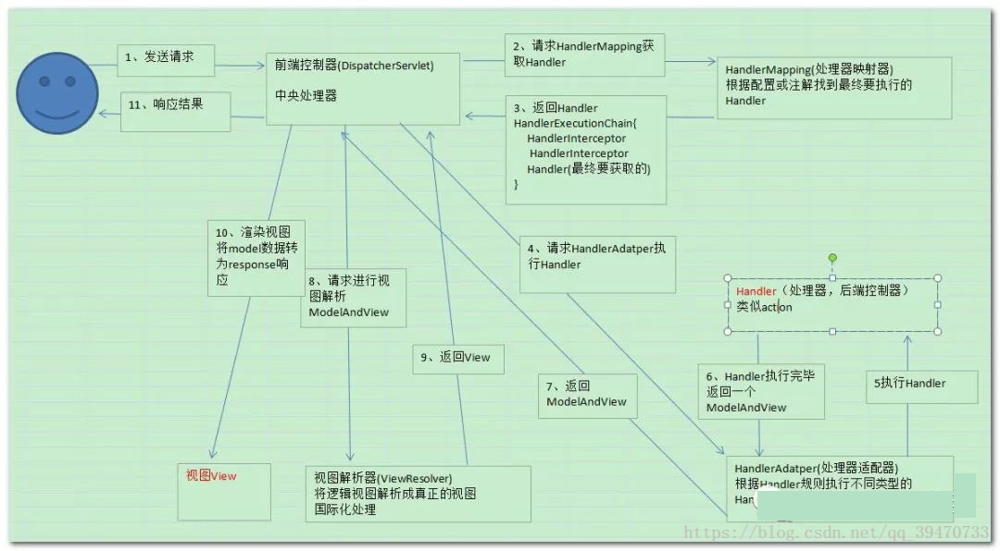

# SpringMVC工作流程

## 工作原理

1. 客户端用户发送请求至前端控制器**DispatcherServlet**；
2. **DispatcherServlet**收到请求调用**HandlerMapping**处理器映射器；
3. **HandlerMapping**处理器映射器找到具体的处理器(可以根据xml配置、注解进行查找)，生成处理器对象及处理器拦截器(如果有则生成)一并返回给**DispatcherServlet**；
4. **DispatcherServlet**调用**HandlerAdapter**处理器适配器，**HandlerAdapter**经过适配调用具体的处理器(Controller，也叫后端控制器)；
5. Controller控制器执行完成返回**ModelAndView**，**HandlerAdapter**将controller执行结果**ModelAndView**返回给**DispatcherServlet**；
6. **DispatcherServlet**前端控制器将**ModelAndView**传给**ViewReslover**视图解析器；
7. **ViewReslover**解析后返回具体View；
8. **DispatcherServlet**根据View进行渲染视图（即将模型数据填充至视图中），并返回给客户端用户。

## SpringMVC框架组件

以下组件通常框架提供实现：

### DispatcherServlet

**作用**：接收请求，响应结果，相当于转发器，中央处理器。有了dispatcherServlet减少了其它组件之间的耦合度。

作为前端控制器，整个流程控制的中心，控制其它组件执行，统一调度，降低组件之间的耦合性，提高每个组件的扩展性。

### HandlerMapping

**作用**：根据请求的url查找Handler。

HandlerMapping负责根据用户请求找到Handler即处理器，springmvc提供了不同的映射器实现不同的映射方式，例如：配置文件方式，实现接口方式，注解方式等。 

### HandlerAdapter

作用：按照特定规则（HandlerAdapter要求的规则）去执行Handler。

通过HandlerAdapter对处理器进行执行，这是适配器模式的应用，通过扩展适配器可以对更多类型的处理器进行执行。

### ViewResolver

作用：进行视图解析，根据逻辑视图名解析成真正的视图（view）。

View Resolver负责将处理结果生成View视图，View Resolver首先根据逻辑视图名解析成物理视图名即具体的页面地址，再生成View视图对象，最后对View进行渲染将处理结果通过页面展示给用户。springmvc框架提供了很多的View视图类型，包括：jstlView、freemarkerView、pdfView等。

## 自定义组件

### 处理器Handler

注意：编写Handler时按照HandlerAdapter的要求去做，这样适配器才可以去正确执行Handler。

Handler 是继DispatcherServlet前端控制器的后端控制器，在DispatcherServlet的控制下Handler对具体的用户请求进行处理。

由于Handler涉及到具体的用户业务请求，所以一般情况需要工程师根据业务需求开发Handler。

### 视图View

View是一个接口，实现类支持不同的View类型（jsp、freemarker、pdf...）