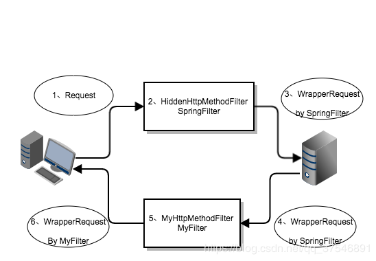

# SpringMVC传参1

## rest风格

### get/post

浏览器支持get/post两种请求方式，所以不会有坑，直接请求即可。传参形式类似如下代码：

- 在RequestMapping的value参数中将要传入的参数名用`{}`包裹，如{id}；
- 在方法传参中以@PathVariable(value="id")String str进行参数传入。

```java
@RequestMapping(value="restGet/{id}/{name}.action",
                method = RequestMethod.GET)
public String restGet(@PathVariable(value = "id")Integer id,
                      @PathVariable(value = "name")String name, 
                      Map<String,Object> map,
                      HttpServletRequest request){
    map.put("studentID",id);
    map.put("studentName",name);
    map.put("requestMethod",request.getMethod());
    return "rest";
}
```

### put/delete

#### filter配置

浏览器表单并不支持put/delete请求方式，但是我们可以在服务器端配置filter对浏览器发送的请求进行过滤，将请求方式转化为put/delete请求。Spring为我们提供了过滤器`org.springframework.web.filter.HiddenHttpMethodFilter`，可以帮助我们将post请求转化为put/delete请求。

在web.xml中进行配置：

```xml
    <filter>
        <filter-name>hiddenHttpMethodFilter</filter-name>
        <filter-class>
            org.springframework.web.filter.HiddenHttpMethodFilter
        </filter-class>
    </filter>
    <filter-mapping>
        <filter-name>hiddenHttpMethodFilter</filter-name>
        <url-pattern>*.action</url-pattern>
    </filter-mapping>
```

使用条件：

1. 表单请求方式必须为post方式。
2. 配置隐藏域：`<input type="hidden" name="_method" value="delete">`

示例：

注意：form的action参数如果为Mapping映射时，前面一定不能加"/"，会报错。

```jsp
<form action="restDelete/10/mjkd.action" method="post">
    <input type="hidden" name="_method" value="delete">
    <input type="submit" value="restDelete">
</form>
```

#### HTTP 405报错

如果web项目是运行在Tomcat 8及以上，会发现被过滤成DELETE和PUT请求，到达控制器时能顺利执行，但是返回时（forward）会报HTTP 405的错误提示：`消息 JSP 只允许 GET、POST 或 HEAD。Jasper 还允许 OPTIONS`；

解决办法：

1. 更换成tomcat 7.x版本

2. 将请求转发（forward）改为请求重定向（redirect）:重定向到一个Controller，由Controller转发到页面，示例：

   ```java
       @RequestMapping(value = "restDelete/{id}/{name}.action",
                       method = RequestMethod.DELETE)
   	public String restDelete(@PathVariable(value = "id")Integer id,
                                @PathVariable(value = "name")String name,
                                HttpServletRequest servlet){
           return "redirect:/views/restToDelete/"+id+"/"+name+
               ".action?request="+servlet.getMethod();
       }
   
   	@RequestMapping(value="restToDelete/{id}/{name}.action",
                       params ="request",method = RequestMethod.GET)
       public ModelAndView restToDelete(@PathVariable(value = "id")Integer id,
                                        @PathVariable(value = "name")String name,
                                        @RequestParam(value = "request")String request){
           ModelAndView mv=new ModelAndView("rest");
           mv.addObject("studentID",id);
           mv.addObject("studentName",name);
           mv.addObject("requestMethod",request);
           return mv;
       }
   ```

3. 创建一个Filter来包装HttpRequest中的getMethod()方法：

   

   - 客户端发送请求至服务器，这时如果发送的是POST请求且带有以_method为名的参数，会被`Spring的HiddenHttpMethodFilter`给拦截；
   - `HiddenHttpMethodFilter`内有一个静态内部类通过继承`HttpServletRequestWrapper`类并重写`getMethod()`方法，将该方法返回值设为_method隐藏域的值；
   - `HiddenHttpMethodFilter`在包装好Request后，将请求发往服务器的控制器中对应的方法处理器，这时的请求变成了图中的`WrapperRequest by SpringFilter`；
   - 服务器处理完请求后，产生了一个forward请求，产生相应的请求处理信息发往客户端，注意这时的request的getMethod()方法仍然是`HiddenHttpMethodFilter`包装过的；
   - 我们需要在服务器的响应请求到达客户端前进行拦截，这也是最关键的一步，通过自定义过滤器MyHttpMethodFilter进一步包装请求，将getMethod()方法返回值改成POST或GET即可；（用HttpRequestWrapper将原始请求包装成一个假的请求并告诉它返回POST来delete和put请求所以Jsp认为这是一个POST请求）
   - 在web.xml中配置该filter，注意dispatcher结点值必须为FORWARD。

## @RequestParam传参

```java
package top.songfang.controller;

import org.springframework.stereotype.Controller;
import org.springframework.web.bind.annotation.*;
import javax.servlet.http.HttpServletRequest;

import top.songfang.entity.Student;

/**
 *  SpringMVC处理各种参数流程/逻辑：
 *    请求：  前端发请求a -> @RequestMapping("a")
 *    处理请求中的参数： public String aa(@RequestParam("a")String str) 各种变量注解
 *
 *  使用对象（实体类接受参数）
 *
 */

@Controller
public class RestController {
    // @RequestParam("name")等价于request.getParameter("name"),接受从前端的传值
    //   required=false 说明这个参数可以不配
    //   defaultValue = "18" 配置默认值
    @RequestMapping(value = "get.action",method = RequestMethod.GET)
    public String getName(@RequestParam("name") String name,
                          @RequestParam(value="age",
                                        required = false,
                                        defaultValue = "18")Integer age){
        System.out.println(name+age);
        return "success";
    }
    // @RequestHeader("key")String al:获取头信息相应key的值
    @RequestMapping(value = "header.action",method = RequestMethod.GET)
    public String getRequest(@RequestHeader("Accept-Language")String str){
        System.out.println(str);
        return "success";
    }
    // @CookieValue
    // 前置知识：服务端接受到客户端第一次请求时，会给该客户端分配一个session（该session包含一个sessionID），
    //   并且服务端会在第一次响应客户端时，会将sessionID赋值给JSESSIONID并传递给客户端。
    @RequestMapping(value = "cookie.action",method = RequestMethod.GET)
    public String getCookie(@CookieValue("JSESSIONID")String jsessionid){
        System.out.println(jsessionid);
        return "success";
    }
    // 自定义对象传入
    // 1. name属性的值必须和对象的属性名一一对应；
    // 2. 支持级联传递，及一个对象可以包含另一个对象，如本例address.homeAddress和address.SchoolAddress
    @RequestMapping("student.action")
    public String getStudent(Student student){
        System.out.println(student);
        return "success";
    }

    // 在SpringMVC中使用原生态的Servlet API
    // 只需要将参数写入即可
    // 在这里有一个小的坑，需要引入Tomcat的依赖，idea中的操作方法：
    //     File->Project Structure->Modules->右侧的项目名-> 选择dependence ->右侧+号-> Library
    @RequestMapping("servlet.action")
    public String getServlet(HttpServletRequest request){
        System.out.println(request.getServletPath());
        return "success";
    }
}
```


