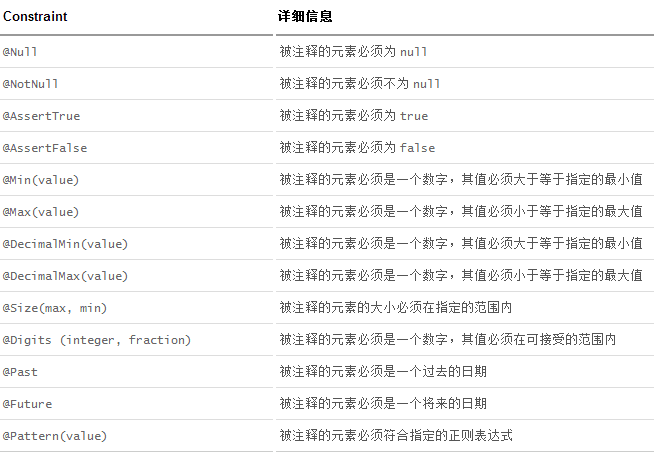
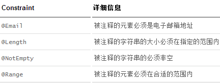

# JSR-303校验

JSR是Java Specification Requests的缩写，意思是Java 规范提案。是指向[JCP](https://link.jianshu.com?t=http%3A%2F%2Fbaike.baidu.com%2Fview%2F148425.htm)(Java Community Process)提出新增一个标准化技术规范的正式请求。任何人都可以提交JSR，以向Java平台增添新的API和服务。JSR已成为Java界的一个重要标准。

## JSR-303

JSR-303 是JAVA EE 6 中的一项子规范，叫做Bean Validation，Hibernate Validator 是 Bean Validation 的参考实现 . Hibernate Validator 提供了 JSR 303 规范中所有内置 constraint 的实现，除此之外还有一些附加的 constraint。

### Bean Validation 中内置的 constraint

### Hibernate Validator 附加的 constraint

参考：

- [https://www.jianshu.com/p/554533f88370](https://www.jianshu.com/p/554533f88370)

- [https://www.ibm.com/developerworks/cn/java/j-lo-jsr303/index.html](https://www.ibm.com/developerworks/cn/java/j-lo-jsr303/index.html)

