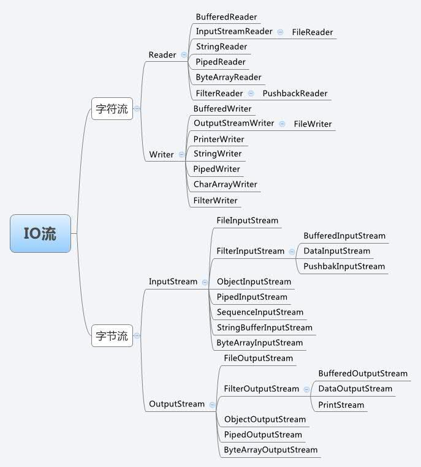
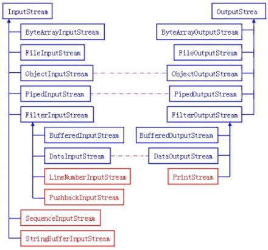

# Java IO流

## File类

1. java.io.file类是专门对文件进行操作的类，只能对文件本身进行操作，不能对文件内容进行操作。
2. File类是“文件和目录路径名的抽象表示”，而不是指文件内容（IO）。
3. File类定义了一些与平台无关的操作方法，如：删除文件、创建文件、重命名等。
4. Java目录被看成一个特殊文件，List()方法可以返回目录中所有的子目录和文件。
5. 在Unix下路径分隔符为（/），在windows下为（\）,在java中可以正确的处理不同系统的分隔符。

构造方法：

- public File（String pathname）：以pathname为路径创建File对象；如果path为相对路径，则是相对于java系统属性的user.dir中的路径；
  - `./`：当前路径所在目录；
  - `../`：代表上一层目录；
  - `/`：代表根目录；

常用方法：

- public boolean canRead()：是否可读
- public boolean canWrite()：是否可写
- public boolean exists() ：是否存在
- public long length ()： 文件长度（以字节为单位）
- public String getName()：获取文件名称
- public String getPath()：获取文件路径，创建File对象时，使用什么路径就返回什么路径，是绝对路径就返回绝对路径，是相对路径就返回相对路径
- public String getAbsolutePath()：返回此File对象的绝对路径名
- public String getParent()：获取父目录

```java
public static void main(String[] args) {
    File file=new File("hello.txt");
    System.out.println("文件是否存在："+file.exists());
    System.out.println("是文件吗："+file.isFile());
    System.out.println("是隐藏文件吗："+file.isHidden());
    System.out.println("是目录吗："+file.isDirectory());
    System.out.println("名称："+file.getName());
    System.out.println("路径："+file.getPath());
    System.out.println("绝对路径："+file.getAbsolutePath());
    System.out.println("父目录："+file.getParent());
    System.out.println("最后修改时间："+ file.lastModified());
    System.out.println("文件大小："+file.length()+"字节");
}
// 输出：
文件是否存在：true
是文件吗：true
是隐藏文件吗：false
是目录吗：false
名称：hello.txt
路径：hello.txt
绝对路径：D:\springboot\interviewing\hello.txt
父目录：null
最后修改时间：1585373746722
文件大小：15字节
```

对文件的操作：

- public boolean createNewFile() :不存在时创建此文件对象所代表的空文件
- public boolean delete()：删除文件。如果是目录必须是空才能删除
- public boolean mkdir() ：创建此抽象路径名指定的目录
- public boolean mkdirs()：创建此抽象路径名指定的目录，包括所有必需但不存在的父目录
- public boolean renameTo(File dest)：重新命名此抽象路径名表示的文件浏览目录中的文件和子目录
- public String[] list() ：返回此目录中的文件名和目录名的数组
- public File[] listFiles() ：返回此目录中的文件和目录的File实例数组
- public File[] listFiles(FilenameFilter filter) ：返回此目录中满足指定过滤器的文件和目录

## RandomAccessFile类

该对象并不是流体系中的一员，其封装了字节流，同时还封装了一个缓冲区（字符数组），通过内部的指针来操作字符数组中的数据。 该对象特点：

该对象只能操作文件，所以构造函数接收两种类型的参数：a.字符串文件路径；b.File对象。

该对象既可以对文件进行读操作，也能进行写操作，在进行对象实例化时可指定操作模式(r,rw)

**注意：该对象在实例化时，如果要操作的文件不存在，会自动创建；如果文件存在，写数据未指定位置，会从头开始写，即覆盖原有的内容。**可以用于多线程下载或多个线程同时写数据到文件。

## IO流

流是一组有序的，有起点和终点的字节集合，是对数据传输的总称和抽象。即数据在两设备之间的传输称为流，流的本质是数据传输，根据数据传输的特性将流抽象为各种类，方便进行更直观的数据操作。

流的分类：

- 根据处理数据类型的不同分为字节流和字符流。

- 根据数据流向的不同分为输入流和输出流。



字符流：因为数据编码的不同，因而有了对字符进行高效操作的流对象，本质其实就是基于字节流读取时，去查了指定的码表；

输入流和输出流：

对输入流只能进行读操作，对输出流只能进行写操作，程序中需要根据待传输数据的特性来选择使用不同的流。

与Java流操作相关的类和接口：


java IO流对象：

1. 输入字节流：InputStream是所有输入字节流的父类，是一个抽象类；

   介质流：

   - ByteArrayInputStream：Byte 数组中读取数据；
   - StringBufferInputStream：StringBuffer中读取数据；
   - FileInputStream：本地文件中读取数据；
   - PipedInputStream：管道字节输入流，它和PipedOutputStream一起使用，能实现**多线程间的管道通信**；

   装饰流：ObjectInputStream 和所有FilterInputStream 的子类都是装饰流（装饰器模式的主角）

   - FilterInputStream：装饰者模式中处于装饰者，具体的装饰者都要继承它，所以在该类的子类下都是用来装饰别的流的，也就是处理类；
   - **DataInputStream**：数据输入流，它是用来装饰其它输入流，它“允许应用程序以与机器无关方式从底层输入流中读取基本 Java 数据类型”；
   - ObjectInputStream：对象输入流，用来提供对“基本数据或对象”的持久存储。通俗点讲，也就是能直接传输对象（反**序列化中使用**）；

2. 输出字节流：OutputStream 是所有的输出字节流的父类，它是一个抽象类。

   介质流：

   - ByteArrayOutputStream：Byte 数组中写入数据；
   - FileOutputStream ：本地文件中写入数据；
   - PipedOutputStream：是向与其它线程共用的管道中写入数据；

   装饰流：ObjectOutputStream 和所有FilterOutputStream 的子类都是装饰流。

3. 字节流输入与输出的对应：蓝色的为主要的对应部分，红色的部分就是不对应部分。*紫色的虚线部分代表这些流一般要搭配使用*。

   

   - LineNumberInputStream：主要完成从流中读取数据时，会得到相应的行号，至于什么时候分行、在哪里分行是由该类主动确定的，并不是在原始中有这样一个行号。在输出部分没有对应的部分，我们完全可以自己建立一个LineNumberOutputStream，在最初写入时会有一个基准的行号，以后每次遇到换行时会在下一行添加一个行号，看起来也是可以的。
   - PushbackInputStream：查看最后一个字节，不满意就放入缓冲区。主要用在编译器的语法、词法分析部分。输出部分的BufferedOutputStream几乎实现相近的功能。
   - StringBufferInputStream 已经被Deprecated，本身就不应该出现在InputStream部分，主要因为String 应该属于字符流的范围。已经被废弃了，当然输出部分也没有必要需要它了！还允许它存在只是为了保持版本的向下兼容而已。
   - SequenceInputStream 可以认为是一个工具类，将两个或者多个输入流当成一个输入流依次读取。完全可以从IO 包中去除，还完全不影响IO 包的结构，却让其更“纯洁”――纯洁的Decorator 模式。
   - PrintStream 也可以认为是一个辅助工具。主要可以向其他输出流，或者FileInputStream写入数据，本身内部实现还是带缓冲的。本质上是对其它流的综合运用的一个工具而已。System.out 和System.out 就是PrintStream 的实例。

4. 字符输入流Reader：Reader 是所有的输入字符流的父类，它是一个抽象类。

   介质流：

   - CharReader：从Char数组读取数据；
   - StringReader ：从String中读取数据；
   - PipedReader：是从与其它线程共用的管道中读取数据；

   装饰流：

   - BufferedReader：装饰器，它和其子类负责装饰其它Reader 对象；
   - FilterReader：是所有自定义具体装饰流的父类，其子类PushbackReader 对Reader 对象进行装饰，会增加一个行号；
   - InputStreamReader ：一个连接字节流和字符流的桥梁，它将字节流转变为字符流；
   - FileReader：可以说是一个达到此功能、常用的工具类，在其源代码中明显使用了将FileInputStream 转变为Reader的方法。我们可以从这个类中得到一定的技巧。Reader 中各个类的用途和使用方法基本和InputStream中的类使用一致。后面会有Reader 与InputStream 的对应关系。

5. 字符输出流Writer：Writer 是所有的输出字符流的父类，它是一个抽象类。

   介质流：

   - CharArrayWriter：向Char数组写入数据；
   - StringWriter：向String中写入数据；
   - PipedWriter：是向与其它线程共用的管道中写入数据；

   装饰流：

   - BufferedWriter：是一个装饰器为Writer 提供缓冲功能；
   - PrintWriter 和PrintStream：极其类似，功能和使用也非常相似；
   - OutputStreamWriter 是OutputStream 到Writer 转换的桥梁，它的子类FileWriter是实现此功能的具体类；

6. 字符流与字节流转换：

   转换流的特点：是字符流和字节流的桥梁；

   - 对读取的字节数据经过指定编码转换成字符；
   - 对读取到的字符数据经过指定编码转换成字节；

   转换流使用：当字节和字符之间存在转换动作时；流操作的数据需要编码或解码时。具体的对象实现：

   - InputStreamReader:字节到字符的桥梁；
   - OutputStreamWriter:字符到字节的桥梁；
   - 这两个流对象是字符体系中的成员，它们有转换作用，本身又是字符流，所以在构造的时候需要传入字节流对象进来。
   
7. **字节流与字符流的区别：**

   - 字节流没有缓冲区，是直接输出的，而字符流是输出到缓冲区的。因此在输出时，字节流不调用colse()方法时，信息已经输出了，而字符流只有在调用close()方法关闭缓冲区时，信息才输出。要想字符流在未关闭时输出信息，则需要手动调用flush()方法。
   - 读写单位不同：字节流以字节（8bit）为单位，字符流以字符为单位，根据码表映射字符，一次可能读多个字节。
   - 处理对象不同：字节流能处理所有类型的数据（如图片、avi等），而字符流只能处理字符类型的数据。
   - 使用：**只要是处理纯文本数据，就优先考虑使用字符流。除此之外都使用字节流。**

8. System类对IO的支持：针对一些频繁的设备交互，Java语言系统预定了3个可以直接使用的流对象，分别是：

   - System.in（标准输入），通常代表键盘输入；
   - System.out（标准输出）：通常写往显示器；
   - System.err（标准错误输出）：通常写往显示器；
   
   Java程序可通过命令行参数与外界进行简短的信息交换，同时，也规定了与标准输入、输出设备，如键盘、显示器进行信息交换的方式。而通过文件可以与外界进行任意数据形式的信息交换。

9. 处理流：

   BufferedReader，BufferedWriter，BufferedInputStream，BufferedOutputsStream，都要包上一层节点流。也就是说处理流是在节点流的基础之上进行的，带有Buffered的流又称为缓冲流，缓冲流处理文件的输入输出的速度是最快的。所以一般缓冲流的使用比较多。

10. Scanner类：

    Java 5添加了java.util.Scanner类，这是一个用于扫描输入文本的新的实用程序。它是以前的StringTokenizer和Matcher类之间的某种结合。由于任何数据都必须通过同一模式的捕获组检索或通过使用一个索引来检索文本的各个部分。于是可以结合使用正则表达式和从输入流中检索特定类型数据项的方法。这样，除了能使用正则表达式之外，Scanner类还可以任意地对字符串和基本类型(如int和double)的数据进行分析。借助于Scanner，可以针对任何要处理的文本内容编写自定义的语法分析器。

    Scanner套接字节流或字符流：

    - 字节流的套接：在Scanner的构造方法中Scanner(InputStream source)，InputStream只要经过适当的套接，总能获得你想要的流接口。
    - 字符流的套接：Scanner(Readable source)，你需要使用Java SE5中新加入的一个接口Readable，该接口表示“具有read()方法的某种东西”，查看Readable接口的API你可以发现你想要的带有Reader的类基本都在其中。

11. 序列化：将保存在内存中的对象数据转化为二进制数据流进行传输，任何对象都可以序列化；

    实现方法：实现java.io.Serializable接口

    作用：把一个Java对象写入到硬盘或者传输到网路上面的其它计算机，这时我们就需要自己去通过java把相应的对象写成转换成字节流。对于这种通用的操作，我们为什么不使用统一的格式呢？没错，这里就出现了java的序列化的概念。在Java的OutputStream类下面的子类ObjectOutputStream类就有对应的WriteObject(Object object) 其中要求对应的object实现了java的序列化的接口。

    示例：在使用tomcat开发JavaEE相关项目的时候，我们关闭tomcat后，相应的session中的对象就存储在了硬盘上，如果我们想要在tomcat重启的时候能够从tomcat上面读取对应session中的内容，那么保存在session中的内容就必须实现相关的序列化操作，还有jdbc加载驱动用的就是反序列化，将字符串变为对象。

12. 反序列化：将二进制数据转换为对象；

    构造方法：ObjectInputStream（InputStream in）

    常用方法：Object readObject() 从 ObjectInputStream 读取对象 

    transient关键字：以上序列化和反序列化实现了的对象序列化，但是可以发现，操作时是将整个对象的所有属性序列化，那么transient关键字可以将某些内容不需要保存，就可以通过transient关键字来定义`private transient string title；`此时title属性无法被序列化。

    示例：

    ```java
    public class SerializableTest {
        public static void main(String[] args) throws IOException, ClassNotFoundException {
            File file=new File("hello.txt");
    
            OutputStream out=new FileOutputStream(file);
            ObjectOutputStream oos=new ObjectOutputStream(out);
            oos.writeObject(new Book("张三","89"));
            oos.close();
            out.close();
    
            InputStream in=new FileInputStream(file);
            ObjectInputStream ois=new ObjectInputStream(in);
            Object obj=ois.readObject();
            Book book=(Book)obj;
            System.out.println(book);
            ois.close();
            in.close();
        }
        static class Book implements Serializable{
            private String title;
            private String price;
    
            public Book(String title, String price) {
                this.title = title;
                this.price = price;
            }
    
            @Override
            public String toString() {
                return "Book{" +
                        "title='" + title + '\'' +
                        ", price='" + price + '\'' +
                        '}';
            }
    
            public String getTitle() {
                return title;
            }
    
            public void setTitle(String title) {
                this.title = title;
            }
    
            public String getPrice() {
                return price;
            }
    
            public void setPrice(String price) {
                this.price = price;
            }
        }
    }
    ```

13. 总结：

    - inputStream类的进阶版Scanner；
    - OutputStream类的进阶版PrintStream；
    - Reader类的进阶版BufferedReader；
    - Writer类的进阶版PrintWriter；
    - 输出数据：PrintStream、PrintWriter
    - 读取数据：Scanner、BufferedReader
      