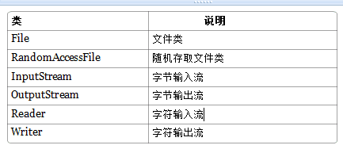

# Java IO流

## File类

1. java.io.file类是专门对文件进行操作的类，只能对文件本身进行操作，不能对文件内容进行操作。
2. File类是“文件和目录路径名的抽象表示”，而不是指文件内容（IO）。
3. File类定义了一些与平台无关的操作方法，如：删除文件、创建文件、重命名等。
4. Java目录被看成一个特殊文件，List()方法可以返回目录中所有的子目录和文件。
5. 在Unix下路径分隔符为（/），在windows下为（\）,在java中可以正确的处理不同系统的分隔符。

构造方法：

- public File（String pathname）：以pathname为路径创建File对象；如果path为相对路径，则是相对于java系统属性的user.dir中的路径；
  - `./`：当前路径所在目录；
  - `../`：代表上一层目录；
  - `/`：代表根目录；

常用方法：

- public boolean canRead()：是否可读
- public boolean canWrite()：是否可写
- public boolean exists() ：是否存在
- public long length ()： 文件长度（以字节为单位）
- public String getName()：获取文件名称
- public String getPath()：获取文件路径，创建File对象时，使用什么路径就返回什么路径，是绝对路径就返回绝对路径，是相对路径就返回相对路径
- public String getAbsolutePath()：返回此File对象的绝对路径名
- public String getParent()：获取父目录

```java
public static void main(String[] args) {
    File file=new File("hello.txt");
    System.out.println("文件是否存在："+file.exists());
    System.out.println("是文件吗："+file.isFile());
    System.out.println("是隐藏文件吗："+file.isHidden());
    System.out.println("是目录吗："+file.isDirectory());
    System.out.println("名称："+file.getName());
    System.out.println("路径："+file.getPath());
    System.out.println("绝对路径："+file.getAbsolutePath());
    System.out.println("父目录："+file.getParent());
    System.out.println("最后修改时间："+ file.lastModified());
    System.out.println("文件大小："+file.length()+"字节");
}
// 输出：
文件是否存在：true
是文件吗：true
是隐藏文件吗：false
是目录吗：false
名称：hello.txt
路径：hello.txt
绝对路径：D:\springboot\interviewing\hello.txt
父目录：null
最后修改时间：1585373746722
文件大小：15字节
```

对文件的操作：

- public boolean createNewFile() :不存在时创建此文件对象所代表的空文件
- public boolean delete()：删除文件。如果是目录必须是空才能删除
- public boolean mkdir() ：创建此抽象路径名指定的目录
- public boolean mkdirs()：创建此抽象路径名指定的目录，包括所有必需但不存在的父目录
- public boolean renameTo(File dest)：重新命名此抽象路径名表示的文件浏览目录中的文件和子目录
- public String[] list() ：返回此目录中的文件名和目录名的数组
- public File[] listFiles() ：返回此目录中的文件和目录的File实例数组
- public File[] listFiles(FilenameFilter filter) ：返回此目录中满足指定过滤器的文件和目录

## RandomAccessFile类

该对象并不是流体系中的一员，其封装了字节流，同时还封装了一个缓冲区（字符数组），通过内部的指针来操作字符数组中的数据。 该对象特点：

该对象只能操作文件，所以构造函数接收两种类型的参数：a.字符串文件路径；b.File对象。

该对象既可以对文件进行读操作，也能进行写操作，在进行对象实例化时可指定操作模式(r,rw)

**注意：该对象在实例化时，如果要操作的文件不存在，会自动创建；如果文件存在，写数据未指定位置，会从头开始写，即覆盖原有的内容。**可以用于多线程下载或多个线程同时写数据到文件。

## IO流

流是一组有序的，有起点和终点的字节集合，是对数据传输的总称和抽象。即数据在两设备之间的传输称为流，流的本质是数据传输，根据数据传输的特性将流抽象为各种类，方便进行更直观的数据操作。

流的分类：

- 根据处理数据类型的不同分为字节流和字符流。

- 根据数据流向的不同分为输入流和输出流。


字符流：因为数据编码的不同，因而有了对字符进行高效操作的流对象，本质其实就是基于字节流读取时，去查了指定的码表；

字符流和字节流的区别：

-  读写单位不同：字节流以字节（8bit）为单位，字符流以字符为单位，根据码表映射字符，一次可能读取多个字节。
- 处理对象不同：字节流能处理所有类型的数据（如图片、.avi等），字符流只能处理纯文本的数据。

输入流和输出流：

对输入流只能进行读操作，对输出流只能进行写操作，程序中需要根据待传输数据的特性来选择使用不同的流。

与Java流操作相关的类和接口：



java IO流对象：

1. 输入字节流：InputStream是所有输入字节流的父类，是一个抽象类；

   介质流：

   - ByteArrayInputStream：Byte 数组中读取数据；
   - StringBufferInputStream：StringBuffer中读取数据；
   - FileInputStream：本地文件中读取数据；
   - PipedInputStream是从与其它线程共用的管道中读取数据。

   装饰流：ObjectInputStream 和所有FilterInputStream 的子类都是装饰流（装饰器模式的主角）

2. 输出字节流：OutputStream 是所有的输出字节流的父类，它是一个抽象类。

   介质流：

   - ByteArrayOutputStream：Byte 数组中写入数据；
   - FileOutputStream ：本地文件中写入数据；
   - PipedOutputStream：是向与其它线程共用的管道中写入数据；

   装饰流：ObjectOutputStream 和所有FilterOutputStream 的子类都是装饰流。

3. 字节流输入与输出的对应：蓝色的为主要的对应部分，红色的部分就是不对应部分。*紫色的虚线部分代表这些流一般要搭配使用*。

   

   - LineNumberInputStream：主要完成从流中读取数据时，会得到相应的行号，至于什么时候分行、在哪里分行是由该类主动确定的，并不是在原始中有这样一个行号。在输出部分没有对应的部分，我们完全可以自己建立一个LineNumberOutputStream，在最初写入时会有一个基准的行号，以后每次遇到换行时会在下一行添加一个行号，看起来也是可以的。
   - PushbackInputStream：查看最后一个字节，不满意就放入缓冲区。主要用在编译器的语法、词法分析部分。输出部分的BufferedOutputStream几乎实现相近的功能。
   - StringBufferInputStream 已经被Deprecated，本身就不应该出现在InputStream部分，主要因为String 应该属于字符流的范围。已经被废弃了，当然输出部分也没有必要需要它了！还允许它存在只是为了保持版本的向下兼容而已。
   - SequenceInputStream 可以认为是一个工具类，将两个或者多个输入流当成一个输入流依次读取。完全可以从IO 包中去除，还完全不影响IO 包的结构，却让其更“纯洁”――纯洁的Decorator 模式。
   - PrintStream 也可以认为是一个辅助工具。主要可以向其他输出流，或者FileInputStream写入数据，本身内部实现还是带缓冲的。本质上是对其它流的综合运用的一个工具而已。System.out 和System.out 就是PrintStream 的实例。

4. 字符输入流Reader：Reader 是所有的输入字符流的父类，它是一个抽象类。

   介质流：

   - CharReader：从Char数组读取数据；
   - StringReader ：从String中读取数据；
   - PipedReader：是从与其它线程共用的管道中读取数据；

   装饰流：

   - BufferedReader：装饰器，它和其子类负责装饰其它Reader 对象；
   - FilterReader：是所有自定义具体装饰流的父类，其子类PushbackReader 对Reader 对象进行装饰，会增加一个行号；
   - InputStreamReader ：一个连接字节流和字符流的桥梁，它将字节流转变为字符流；
   - FileReader：可以说是一个达到此功能、常用的工具类，在其源代码中明显使用了将FileInputStream 转变为Reader的方法。我们可以从这个类中得到一定的技巧。Reader 中各个类的用途和使用方法基本和InputStream中的类使用一致。后面会有Reader 与InputStream 的对应关系。

5. 字符输出流Writer：Writer 是所有的输出字符流的父类，它是一个抽象类。

   介质流：

   - CharArrayWriter：向Char数组写入数据；
   - StringWriter：向String中写入数据；
   - PipedWriter：是向与其它线程共用的管道中写入数据；

   装饰流：

   - BufferedWriter：是一个装饰器为Writer 提供缓冲功能；
- PrintWriter 和PrintStream：极其类似，功能和使用也非常相似；
   - OutputStreamWriter 是OutputStream 到Writer 转换的桥梁，它的子类FileWriter是实现此功能的具体类；

6. 字符流与字节流转换：

   转换流的特点：是字符流和字节流的桥梁；

   - 对读取的字节数据经过指定编码转换成字符；
   - 对读取到的字符数据经过指定编码转换成字节；

   转换流使用：当字节和字符之间存在转换动作时；流操作的数据需要编码或解码时。具体的对象实现：

   - InputStreamReader:字节到字符的桥梁；
   - OutputStreamWriter:字符到字节的桥梁；
   - 这两个流对象是字符体系中的成员，它们有转换作用，本身又是字符流，所以在构造的时候需要传入字节流对象进来。


​     