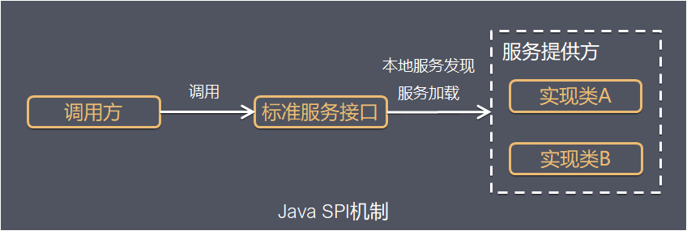

# java spi机制

## 概要

SPI：Service Provider Interface，是Java提供的一套用来被第三方实现或者扩展的API，它可以用来启用框架扩展和替换组件。

提供的一套用来被第三方实现或者扩展的API，它可以用来启用框架扩展和替换组件。



Java SPI实际上是”基于接口的编程+策略模式+配置文件“的组合实现的动态加载机制，核心思想就是解耦。

## 使用场景

SPI适用于调用者根据实际使用需要，启用、扩展、或者替换框架的实现策略；

常见实例：

- 数据库驱动加载接口实现类的加载
   JDBC加载不同类型数据库的驱动
- 日志门面接口实现类加载
   SLF4J加载不同提供商的日志实现类
- Spring
   Spring中大量使用了SPI,比如：对servlet3.0规范对ServletContainerInitializer的实现、自动类型转换Type Conversion SPI(Converter SPI、Formatter SPI)等
- Dubbo
   Dubbo中也大量使用SPI的方式实现框架的扩展, 不过它对Java提供的原生SPI做了封装，允许用户扩展实现Filter接口

## 约定

要使用Java SPI，需要遵循如下约定：

1. 当服务提供者提供了接口的一种具体实现后，在jar包的META-INF/services目录下创建一个以“接口全限定名”为命名的文件，内容为实现类的全限定名；
2. 接口实现类所在的jar包放在主程序的classpath中；
3. 主程序通过java.util.ServiceLoder动态装载实现模块，它通过扫描META-INF/services目录下的配置文件找到实现类的全限定名，把类加载到JVM；
4. SPI的实现类必须携带一个不带参数的构造方法；

## 示例

1. 定义一组接口，并写出接口的一个或多个实现

    ```java
    @FunctionalInterface
    public interface TalkInterface {
        void talk();
    }

    public class TeacherTalk implements TalkInterface {
        @Override
        public void talk() {
            System.out.println("做一个好老师！");
        }
    }

    public class StudentTalk implements TalkInterface {
        @Override
        public void talk() {
            System.out.println("好好学习，天天向上！");
        }
    }
    ```
    
2. 在 src/main/resources/ 下建立 /META-INF/services 目录， 新增一个以接口命名的文件 (top.test.TalkInterface文件)，内容是要应用的实现类（这里是top.test.StudentTalk和TeacherTalk，每行一个类）

3. 使用ServiceLoader来加载配置文件中指定的实现

    ```java
    import java.util.ServiceLoader;
    
    public class Test {
        public static void main(String[] args) {
            ServiceLoader<ITalk> iTalks=ServiceLoader.load(ITalk.class);
            for(ITalk iTalk:iTalks){
                System.out.print(iTalk);
                iTalk.talk();
            }
        }
    }
    ```

## 原理

```java
public final class ServiceLoader<S>
    implements Iterable<S>
{

    private static final String PREFIX = "META-INF/services/";

    // 代表被加载的类或接口
    private final Class<S> service;

    // 用于定位、加载和实例化providers的类加载器
    private final ClassLoader loader;

    // 创建ServiceLoader时采用的访问控制上下文
    private final AccessControlContext acc;

    // 缓存providers，按实例化的顺序排列
    private LinkedHashMap<String,S> providers = new LinkedHashMap<>();

    // 懒查找迭代器
    private LazyIterator lookupIterator;
    ------------
```

流程：

1. 应用程序调用ServiceLoader.load方法

   ServiceLoader.load方法内先创建一个新的ServiceLoader，并实例化该类中的成员变量，包括：

   - loader(ClassLoader类型，类加载器)
   - acc(AccessControlContext类型，访问控制器)
   - providers(LinkedHashMap<String,S>类型，用于缓存加载成功的类)
   - lookupIterator(实现迭代器功能)

2. 应用程序通过迭代器接口获取对象实例

   ServiceLoader先判断成员变量providers对象中(LinkedHashMap<String,S>类型)是否有缓存实例对象，如果有缓存，直接返回。

   如果没有缓存，执行类的装载，实现如下：

   1. 读取META-INF/services/下的配置文件，获得所有能被实例化的类的名称，值得注意的是，ServiceLoader**可以跨越jar包获取META-INF下的配置文件**，具体加载配置的实现代码如下：

      ```java
       try {
                  String fullName = PREFIX + service.getName();
                  if (loader == null)
                      configs = ClassLoader.getSystemResources(fullName);
                  else
                      configs = loader.getResources(fullName);
              } catch (IOException x) {
                  fail(service, "Error locating configuration files", x);
              }
      ```

   2. 通过反射方法Class.forName()加载类对象，并用instance()方法将类实例化。

   3. 把实例化后的类缓存到providers对象中，(LinkedHashMap<String,S>类型）
       然后返回实例对象。

## 总结

**优点：**

使用Java SPI机制的优势是实现解耦，使得第三方服务模块的装配控制的逻辑与调用者的业务代码分离，而不是耦合在一起。应用程序可以根据实际业务情况启用框架扩展或替换框架组件。

相比使用提供接口jar包，供第三方服务模块实现接口的方式，SPI的方式使得源框架，不必关心接口的实现类的路径，可以不用通过下面的方式获取接口实现类：

- 代码硬编码import 导入实现类
- 指定类全路径反射获取：例如在JDBC4.0之前，JDBC中获取数据库驱动类需要通过**Class.forName("com.mysql.jdbc.Driver")**，类似语句先动态加载数据库相关的驱动，然后再进行获取连接等的操作
- 第三方服务模块把接口实现类实例注册到指定地方，源框架从该处访问实例

通过SPI的方式，第三方服务模块实现接口后，在第三方的项目代码的META-INF/services目录下的配置文件指定实现类的全路径名，源码框架即可找到实现类

**缺点**：

- 虽然ServiceLoader也算是使用的延迟加载，但是基本只能通过遍历全部获取，也就是接口的实现类全部加载并实例化一遍。如果你并不想用某些实现类，它也被加载并实例化了，这就造成了浪费。获取某个实现类的方式不够灵活，只能通过Iterator形式获取，不能根据某个参数来获取对应的实现类。
- 多个并发多线程使用ServiceLoader类的实例是不安全的。