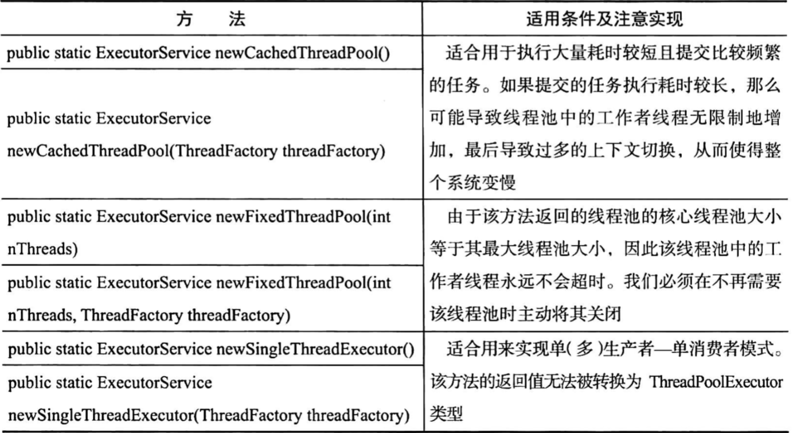

# 使用工具类Executors

Executors类，提供了一系列工厂方法用于创建线程池，返回的线程池都实现了ExecutorService接口。

1. public static ExecutorService newFiexedThreadPool(int Threads) 创建固定数目线程的线程池;
2. public static ExecutorService newCachedThreadPool()：创建一个可缓存的线程池，调用execute 将重用以前构造的线程（如果线程可用）。如果没有可用的线程，则创建一个新线程并添加到池中。终止并从缓存中移除那些已有 60 秒钟未被使用的线程;

3. public static ExecutorService newSingleThreadExecutor()：创建一个单线程化的Executor;

4. public static ScheduledExecutorService newScheduledThreadPool(int corePoolSize);

