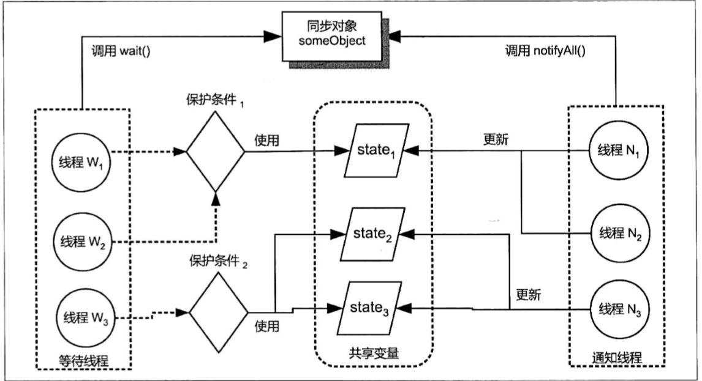

#  多线程实践

## 实践策略

1. 挖掘出程序的可并发点--------实现多线程目标并发计算的前提；
2. 实现并发化的策略：
   - 基于数据的分割策略：从程序处理的数据入手，将原始输入分解成若干规模更小的子输入，并将这些子输入指派给专门的工作线程；
   - 基于任务的分割策略：从程序处理逻辑入手，将原始任务处理逻辑按照**任务的资源消耗属性**或者**处理步骤分解**为若干子任务，并创建专门的工作者线程来执行这些子任务，其结果是产生多个相互协作的异质工作线程。
3. 注意事项：
   - 多线程比相应单线程复杂，且未必有单线程快；
   - 线程数的合理设置：
     - Amdahl's定律
     - 处理器数目
     - 任务性质：IO密集/处理器密集
     - 资源使用规划
     - 稀缺资源使用情况
   - 更快的代价：额外的开销；
   - 工作者线程异常处理；
   - 原始规模未知问题的应对；

## 线程间协作

### 等待与通知

> 在单线程编程中，程序目标动作需要满足一定条件才执行时可以将该动作放入if语句体中；在多线程中，该条件未满足有可能只是暂时的，我们可以等待其他线程更新了保护条件涉及的共享变量而得以执行。因此，我们可以将当前线程暂停，直到所需要的保护条件成立时才唤醒。

```java
// 原子操作
atomic{
    while(保护条件不成立){
        // 暂停当前线程
    }
    // 执行目标动作
    doAction();
}
```

**等待**：一个线程因其执行目标动作所需的保护条件未满足而被暂停的过程叫等待；

**唤醒**：一个线程更新了系统的状态，使得其他线程所需的保护线程得以满足的时候唤醒那些暂停的线程的过程叫通知。

等待线程执行：Object.wait()/wait(long)

通知线程执行：Object.notify()/notifyAll()

伪代码示意：

```java
// 使用Object.wait()实现等待
// 在调用wait方法前获得相应的内部锁
// 受保护方法：保护条件、暂停当前线程和目标动作
synchronized(someObject){
    while(保护条件不成立){
        // 调用Object.wait()暂停当前线程
        someObject.wait();
    }
    // 代码执行到此说明保护条件已满足
    // 执行目标动作
    doAction();
}

// 注意：
// 1.等待线程对保护条件的判断、Object.wait()的调用总
//  是应该放在相应对象所引导的临界区中的一个循环语句之中；
// 2.等待线程对保护条件的判断、Object.wait()的执行以及
//  目标动作的执行必须放在同一个对象（内部锁）所引导的临界区中。
// 3.Object.wait()暂停当前线程时释放的锁只是与该wait
//  方法所属对象的内部锁。当前线程所持有的其他内部锁、显示
//  锁不会因此被释放。
```

```java
// 通知方法：更新共享变量、唤醒其他线程
synchronized(someObject){
    // 更新等待线程的保护条件涉及的共享变量
    updateSharedState();
    // 唤醒其他线程
    someObject.notify();
}
// 注意：等待线程和通知线程必须调用同一个对象的wait方法、
// notify方法来实现等待和通知。调用一个对象的notify方法
// 所唤醒的线程仅是该对象上的一个任意等待线程。notify方法
// 调用应尽可能的放在靠近临界区结束的地方。
```

```java
import java.util.Random;

public class AlarmAgent {
    // 保存该类唯一实例
    private final static AlarmAgent INSTANCE=new AlarmAgent();
    // 是否连上告警服务器
    private boolean connectedToServer=false;
    // 心跳线程，用于检测告警代理与告警服务器的网络连接是否正常
    private final HeartbeatThread heartbeatThread=new HeartbeatThread();

    // 私有构造
    private AlarmAgent() {
    }

    public static AlarmAgent getInstance(){
        return INSTANCE;
    }

    public void init(){
        connectedToServer();
        heartbeatThread.setDaemon(true);
        heartbeatThread.start();
    }

    private void connectedToServer(){
        // 创建并启动网络连接线程，在该线程与告警服务器建立连接
        new Thread(()->{
            Thread.currentThread().setName("监控线程");
            Debug.info("监控线程创建成功！");
            doConnect();
        }).start();
    }

    private void doConnect() {
        // 模拟实际操作耗时
        Tools.randomPause(100);
        synchronized (this){
            connectedToServer=true;
            // 连接建立完毕，通知以唤醒告警线程
            notify();
        }
    }
    public void sendAlarm(String message) throws InterruptedException {
        synchronized (this){
            // 使当前线程等待，直到告警代理与告警服务器的连接建立完毕
            // 或者恢复
            while (!connectedToServer){
                Debug.info("Alarm agent was not connected to server.");
                wait();
            }
            // 真正将告警消息上报到告警服务器
            doSendAlarm(message);
        }
    }

    private void doSendAlarm(String message) {
        //
        Debug.info("Alarm sent:%s",message);
    }
    // 心跳线程
    class HeartbeatThread extends Thread{
        @Override
        public void run() {
            Thread.currentThread().setName("心跳线程");
            try{
                // 留一定的时间给网络连接线程与告警服务器建立连接
                Thread.sleep(1000);
                while (true){
                    if(checkConnection()){
                        connectedToServer=true;
                        Debug.info("网络连接成功");
                    }else{
                        connectedToServer=false;
                        Debug.info("Alarm agent与服务器失联");

                        // 检测到连接中断，重新建立连接
                        connectedToServer=true;
                    }
                    Thread.sleep(2000);
                }
            } catch (InterruptedException e) {
                e.printStackTrace();
            }
        }

        // 检测与告警服务器的网络连接情况
        private boolean checkConnection() {
            boolean isConnected=true;
            final Random random=new Random();
            // 模拟随机性的网络断联
            int rand=random.nextInt(1000);
            if(rand<=500){
                isConnected=false;
            }
            return isConnected;
        }
    }
}

```

```java
import java.util.Random;

public class TimeoutWaitExample {
    private static final Object lock=new Object();
    private static boolean ready=false;
    protected static final Random random=new Random();

    public static void main(String[] args) throws InterruptedException {
        Thread t=new Thread(){
            @Override
            public void run() {
                for(;;){
                    synchronized (lock){
                        ready= true;// random.nextInt(100) < 20;
                        if(ready){
                            lock.notify();
                        }
                    }
                    // 使当前线程暂停一段随机时间
                    Tools.randomPause(500);
                }
            }
        };
        t.setDaemon(true);
        t.start();
        waiter(1000);
    }

    private static void waiter(final long timeOut) throws InterruptedException {
        if(timeOut<0){
            throw new IllegalArgumentException();
        }

        long start=System.currentTimeMillis();
        System.out.println(start);
        long waitTime;
        long now;
        synchronized (lock){
            while(!ready){
                now=System.currentTimeMillis();
                System.out.println(now);
                // 计算剩余时间
                waitTime=timeOut-(now-start);
                Debug.info("剩余时间：%sms",waitTime);
                if(waitTime<=0){
                    // 等待超时退出
                    break;
                }
                lock.wait(waitTime);
            }

            if(ready){
                // 执行目标动作
                guardedAction();
            }else{
                // 等待超时，保护条件未成立
                Debug.error("等待超时，保护条件未成立!");
            }
        }
    }

    private static void guardedAction() {
        Debug.info("任务动作！");
    }
}
```

等待线程：someObject为java任意类实例，因执行someObject.wait()而被暂停的线程就称为对象someObject的等待线程。

- 同一对象可能有多个等待线程；
- 其他线程可以通过someObject.notify()来唤醒等待线程；

开销及问题：

- 使用Condition接口
  - 过早唤醒：设一组等待/通知线程同步在someObject上，初始条件下所有保护条件都不成立，然后某个线程更新了共享变量state1使保护条件，使用了someObject.notifyAll唤醒了同步在someObject上的所有线程，而有些线程保护条件并未满足，叫做过早唤醒。

    

  - Object.wait(long)无法区分其返回是否是等待超时导致；

- 将等待线程对保护条件的判断、Object.wait()的调用放在相应对象所引导的临界区中的一个循环语句中；

  - 信号丢失问题：如果等待线程在执行Object.wait()前没有判断保护条件是否成立，就有可能出现在等待线程进入临界区之前就更新了相关共享变量，使得相应的保护条件成立并进行了通知，而此时的等待线程尚未被暂停。可能会造成等待线程直接执行Object.wait()被暂停的时候iu，该线程由于没有其他线程进行通知而一直处于等待状态。相当于该等待线程错过了一个本来发送给它的信号，因此叫信号丢失。
    - 解决办法：将保护条件的判断和Object.wait()放在同一循环语句；
  - 欺骗性唤醒问题

- 确保正确性的前提下用Object.notify()代替Object.notifyAll()，通知线程尽快释放锁；

  - 较多的上下文切换：

**Object.notify与Object.notifyAll的选用**：Object.notify()唤醒的是其所属对象上的任意一个等待线程，唤醒时不考虑保护条件；Object.notifyAll()唤醒的是其所属对象的所有等待线程。

选用Object.notify的情况：

- 一次通知只需唤醒至多一个线程；
- 相应对象上的所有等待线程都是同质等待线程（指这些等待线程使用同一个保护条件且Object.wait()调用返回后的处理逻辑一致，最典型的是从同一个Runnable接口实例或同一个Thread子类的new出的多个实例）。

**Thread.join():**

Thread.join()可以使当前线程等待目标线程结束之后才继续运行。该方法有一个带时间的版本`public final void join(long millis) throw InterruptedException`  允许指定一个超时时间，如果目标线程没有在指定时间内终止，当前线程也会执行。

#### Java条件变量

- 为规避过早唤醒问题提供支持：使用不同保护条件的等待线程调用不同的条件变量await方法来实现其等待。
- 使用java.util.concurrent.locks.Condition接口来替代wait/notify，Condition的await、signal、signalAll相当于Object.wait()、notify、notifyAll。
- Lock.newCondition()返回一个Condition实例，因此调用任意一个显示锁实例的newCondition方法可以创建一个相应的Condition接口。类似Object.wait/notify需要执行线程持有这些方法所属对象的内部锁，Condition.await/signal也要求执行线程持有创建该Condition实例的显示锁。Condition实例也成为条件变量/条件队列。

```java
import java.util.concurrent.locks.Condition;
import java.util.concurrent.locks.Lock;
import java.util.concurrent.locks.ReentrantLock;

public class ConditionTest {
    private final Lock lock=new ReentrantLock();
    private final Condition condition=lock.newCondition();
    
    public void guardMethod1() throws InterruptedException{
        lock.lock();
        try{
            // 保护条件和condition.await()放在同一循环语句，
            // 且循环语句与目标动作放在同一个显示锁引导的临界区
            // 是为了避免欺骗性唤醒、信号丢失。
            while(保护条件不成立){
                condition.await();
            }
            // 执行目标动作
            doAction();
        }finally {
            lock.unlock();
        }
    }

    private void doAction() {
    }

    public void notificationMethod1()throws InterruptedException{
        lock.lock();
        try {
            // 更新共享变量
            changeState();
            condition.signal();
        }
        finally {
            lock.unlock();
        }
    }

    private void changeState() {
    }
}

```


Condition.awaitUntil(Date deadline)可以实现带超时时间限制的等待，并且该方法的返回值能够区分该方法是由于超时等待而返回还是由于其他线程执行相应变量的signal或signalAll而返回。

示例：

```java
import java.util.Date;
import java.util.Random;
import java.util.concurrent.locks.Condition;
import java.util.concurrent.locks.Lock;
import java.util.concurrent.locks.ReentrantLock;

public class TimeoutWaitWithCondition {
    private static final Lock LOCK=new ReentrantLock();
    private static final Condition CONDITION=LOCK.newCondition();
    private static boolean ready=false;
    protected static final Random RANDOM=new Random();

    public static void main(String[] args) {
        Thread t=new Thread(){
            @Override
            public void run() {
                for(;;){
                    LOCK.lock();
                    try {
                        ready=RANDOM.nextInt(100)<50;
                        if(ready){
                            CONDITION.signal();
                        }
                    }
                    finally {
                        LOCK.unlock();
                    }
                    // 暂停当前线程一段时间
                    Tools.randomPause(500);
                }
            }
        };
        t.setDaemon(true);
        t.start();
        waiter(1000);
    }
    public static void waiter(final long timeOut){
        if (timeOut<0){
            throw new IllegalArgumentException();
        }
        // 计算最后的等待期限
        final Date deadline=new Date(System.currentTimeMillis()+timeOut);
        System.out.println(deadline);
        // 是否继续等待
        boolean continueToWait=true;
        LOCK.lock();
        try {
            while (!ready){
                Debug.info("等待是否超时：%s",continueToWait);
                if(!continueToWait){
                    // 等待超时退出
                    Debug.info("等待超时");
                    return;
                }
                // 返回值为false说明超时
                continueToWait=CONDITION.awaitUntil(deadline);
            }
            // 执行目标动作
            action();
        } catch (InterruptedException e) {
            e.printStackTrace();
        } finally {
            LOCK.unlock();
        }
    }

    private static void action() {
        Debug.info("目标动作！");
    }
}

```

#### 倒计时协调器

Thread.join()实现了一个线程等待另外一个线程结束，有时候一个线程可能只需要等待其他线程执行特定的操作结束即可，而不必等待线程终止。这是后，可以使用java.util.concurrent.CountDownLatch;

CountDownLatch可以用来实现一个或多个线程等待其他线程完成一组特定操作之后才继续运行，这组操作被称为**先决操作**。

CountDownLatch内部维护一个用于表示未完成的先决操作数量的计数器；CountDownLatch.countDown没执行一次，相应实例的计数器值减一；CountDownLatch.await相当于一个受保护方法，保护条件”计数器值为0“。

public CountDownLatch(int count)

CountDownLatch内部计数器值达到0后就恒定不变，后续执行CountDownLatch实例的await方法的任何一个线程都不会被暂停，为了避免等待线程永远被暂停，CountDownLatch.countDown()调用必须放在代码中总是可以被执行到的地方，比如finally块中。

实例：

```java
import java.util.concurrent.CountDownLatch;

interface Test{
    void say();
}
// 定义公共处理逻辑
abstract class AbstractTest implements Test{
    final CountDownLatch latch;
    boolean started=false;
    protected AbstractTest(CountDownLatch countDownLatch) {
        this.latch= countDownLatch;
    }
    void start(){
        new Service().start();
    }
    @Override
    public void say() {
        System.out.println("Test1");
    }

    class Service extends Thread{
        @Override
        public void run() {
            final String name=AbstractTest.this.getClass().getName();
            System.out.println(name);
            try{
                say();
                started=true;
            }finally {
                latch.countDown();
            }
        }
    }
    boolean isStarted(){
        return started;
    }
}
class Test1 extends AbstractTest{
    protected Test1(CountDownLatch countDownLatch) {
        super(countDownLatch);
    }

    @Override
    public void say() {
        System.out.println("Test1");
    }
}
class Test2 extends AbstractTest{

    protected Test2(CountDownLatch countDownLatch) {
        super(countDownLatch);
    }

    @Override
    public void say() {
        System.out.println("Test2");
    }
}
public class CountDownTest {
    public static void main(String[] args) throws InterruptedException {
        CountDownLatch countDownLatch=new CountDownLatch(2);
        AbstractTest test1=new Test1(countDownLatch);
        AbstractTest test2=new Test2(countDownLatch);
        test1.start();
        test2.start();
        if (test1.started&&test2.started){
            System.out.println("true");
        }
        countDownLatch.await();
        System.out.println("好好");
    }
}
```

```java
import java.util.concurrent.CountDownLatch;

public class CountDownSingleTest {
    private static final CountDownLatch LATCH=new CountDownLatch(4);
    private static int data;
    public static void main(String[] args) throws InterruptedException {
        Thread t=new Thread(){
            @Override
            public void run() {
                for (int i = 0; i < 10; i++) {
                    data=i;
                    LATCH.countDown();
                    // 使当前线程暂停一段时间
                    Tools.randomPause(1000);
                }
            }
        };
        t.start();
        LATCH.await();
        System.out.println("暂停在data="+data);
    }
}
// 暂停在data=3

// 原因：LATCH.countDown();被t执行了四次之后，main线程对latch.await()的调用就返回了，从而使该线程被唤醒。
```