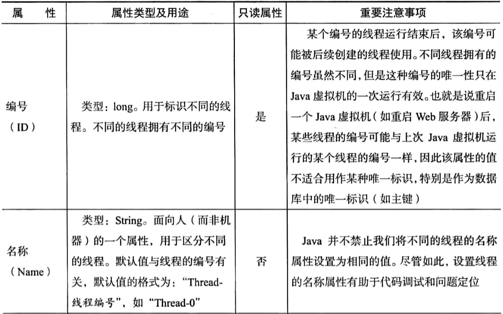
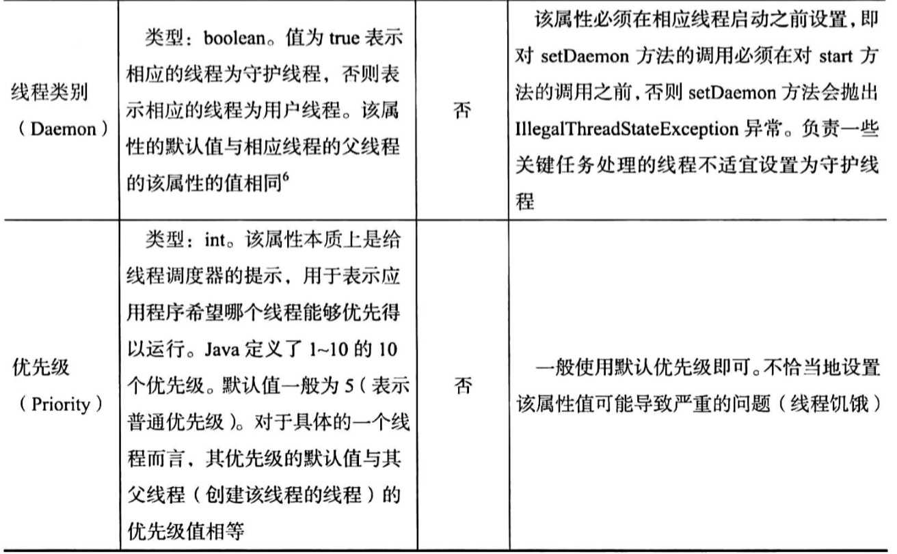
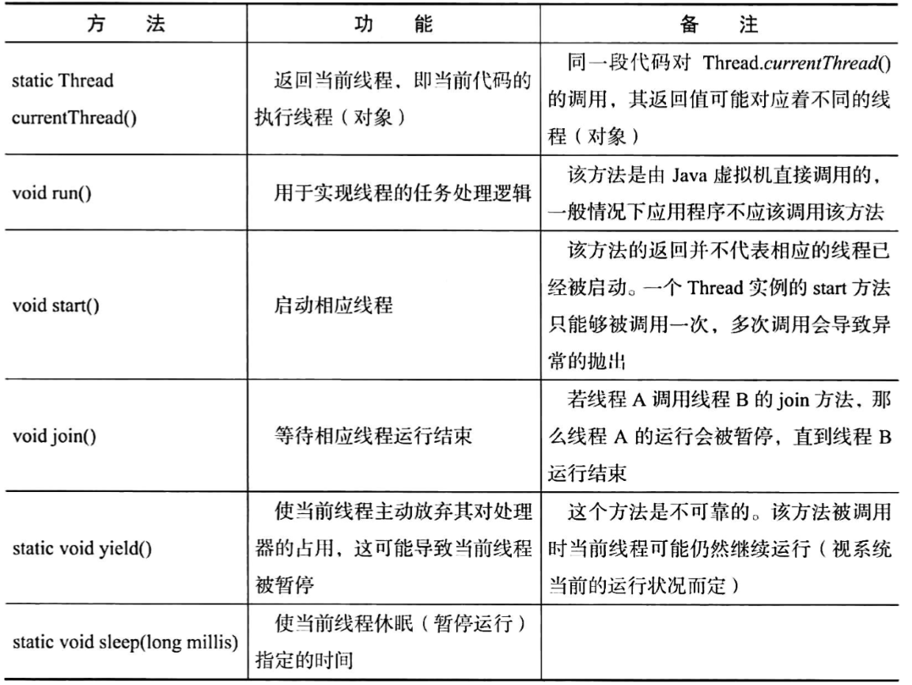
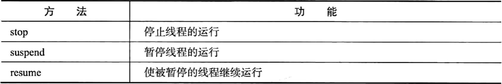
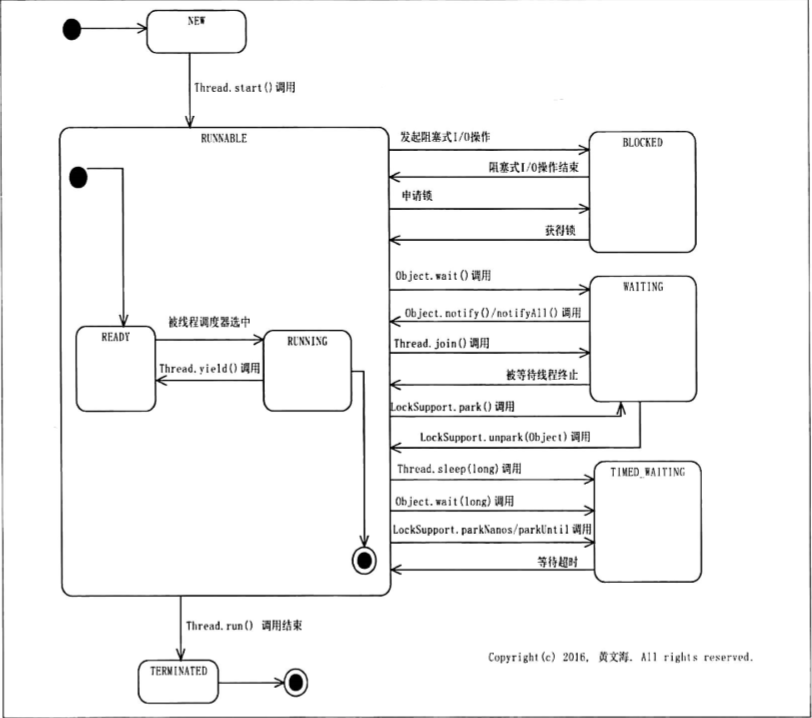

# 线程

## 概念

- 进程（process）：程序的运行实例，是程序向操作系统申请资源（比如内存空间和文件句柄）的基本单位；
- 线程（Thread）：
  - 进程中可独立执行的单位；
  - 一个进程可以包含多个线程；
  - 同一进程中的所有线程共享该进程中的资源，如内存空间，文件句柄等；
- 任务：线程要完成的计算就被称为任务，特定的线程总是在执行着特定的任务；
- 函数式编程（Functional Programming）：函数式基本抽象单位；
- 面向对象编程：类是基本抽象单位；
- 多线程编程：以线程为基本抽象单位的一种编程范式（Paradigm）；

## Java线程API

Java标准库类java.lang.Thread就是Java平台对线程的实现。Thread类或其子类的一个实例就是一个线程。

### 线程创建、启动、运行

#### 线程创建

创建线程就是创建一个Thread类或其子类的实现，线程的任务逻辑放在Thread的run()方法中。

Thread常用构造器：Thread()与Thread(Runnable target)

示例：

```java
// 获取处理器个数的方法：
Runtime.getRuntime().availableProcessors();

// 1.继承Thread创建线程
public class Test1 {
    static class TestThread1 extends Thread{
        @Override
        public void run() {
            System.out.println("当前线程名："+Thread.currentThread().getName());
        }
    }

    public static void main(String[] args) {
        TestThread1 thread1=new TestThread1();
        thread1.setName("测试线程");
        thread1.start();
        System.out.println("主线程名："+Thread.currentThread().getName());
    }
    // 输出结果：
    //   主线程名：main
    //   当前线程名：测试线程
}

// 2.实现Runnable接口
public class Test2 {
    public static void main(String[] args) {
        Thread thread=new Thread(()->{
            Thread.currentThread().setName("测试线程");
            System.out.println("当前线程名："+Thread.currentThread().getName());
        });
        thread.start();
        System.out.println("主线程名:"+Thread.currentThread().getName());
    }
    // 输出结果：
    //   主线程名：main
    //   当前线程名：测试线程
}

```

#### 线程启动

通过Thread类的start()方法启动相应线程，实质是请求java虚拟机运行相应的线程，该线程何时运行由线程调度器Scheduler（操作系统一部分）决定。start()方法调用结束不意味相应线程开始运行。

### 线程属性





- 线程名称：为了方便调试，尽量设置易懂的线程名；
- 优先级：设置不当，会产生线程饥饿的问题。且优先级只是给线程调度器的提示信息，以便线程调度器决定优先调度哪个程序运行，并不能保证线程按照优先级给定的顺序运行；
- 按着线程是否阻止Java虚拟机的正常停止，分为守护线程（Daemon Thread）和用户线程（User Thread），线程的daemon属性用于表示相应线程是否为守护线程：
  - 用户线程会阻止Java虚拟机的正常停止，即一个Java虚拟机只有在其所有用户线程都运行结束（即Thread.run()调用未结束）的情况下才能正常停止；
  - 守护线程则不会影响Java虚拟机的正常停止，一般用于执行一些重要性不是很高的任务，比如监视其他线程的运行情况。
  - Java虚拟机被强制停止时比如Linux的kill命令，用户线程也无法阻止Java虚拟机的停止。

### Thread常用方法



- Java中任何一段代码总是执行在某个线程之中，执行当前代码的线程就被称为当前线程。Thread.currentThread()可以返回当前线程，由于同一段代码可能被不同的线程执行，因此当前线程是相对的，即Thread.currentThread的返回值在代码实际运行的时候可能对应着不同的线程（对象）。

#### 已废弃的方法



### 线程层次关系

- 默认情况：
  - 子线程是否是守护线程取决于父线程；
  - 子线程的优先级为该线程的父线程优先级；

### 线程生命周期



线程状态值可以通过Thread.getState()调用获取得到一个Thread.State的枚举类型（Enum），定义了如下几种情况（均为大写）：

- New：线程已创建而未启动，一个实例线程只能被启动一次，即一个线程只能一次处于该状态；
- Runnable：可以看成复合状态，包括两个子状态：
  - Ready：表示该线程可以被线程调度器进行调度而使之处于Running状态（又叫活跃线程）；
  - Running：表示该线程run方法正在执行，执行Thread.yield()的线程，相应状态可能会由Running转为Ready。
- Blocked：一个线程发起一个阻塞式I/O(Blocking I/O)操作后，或者申请一个由其它线程持有的独占资源（比如锁）时，相应的线程会处于该状态。处于Blocked状态的线程并不占用处理器资源，当阻塞式I/O操作完成后或者线程获得了其申请的资源，该线程的状态又可以转换为Runnable。
- Waiting：执行了特定方法就会处于这种等待其他线程执行另外一些特定操作的状态：
  - Object.wait()
  - Thread.join()
  - LockSupport.park(Object)
  - 由waiting转为Runnable状态的方法：
    - Object.notify()/notifyAll()
    - LockSupport.unpack(Object)
- Time_waiting：类似Waiting，差别在于该状态的线程并非无限制的等待其他线程执行特定操作，而是处于带时间限制的等待状态。当其他线程没有在指定时间内执行该线程所期望的特定操作时，该线程状态自动转为Runnable。
- Terminated：已经执行结束的线程处于该状态。一个线程只能处于一次该状态，Thread.run()正常返回或抛出异常提前终止都会处于该状态。

### 线程监视

对线程监视的主要途径：获取并查看程序的线程转储（Thread Dump）。

获取线程转储主要工具（平台无关）：

- jstack -1 PID
  - PID：Java程序的进程ID，可以通过JDK的jps命令（位于JDK\bin\jps）或Linux的ps命令获取；
  - jstack：Oracle JDK自带的工具；
- jvisualvm的Thread Dump按钮（适合开发和测试环境）
- JMC（Java Mission Control）

## 多线程

### 串行、并行、并发

有A、B、C三任务，有a、b、c三个人；

- 串行：a按A任务开始到完成，B任务开始到完成，C任务开始到完成的顺序完成三个任务；
- 并发：a在做好A任务的准备后，在等待A执行完成的过程中直接开始B任务的准备，然后在B任务准备好后等待B任务执行完的过程中开始C任务的准备，能够节省时间；
- 并行：A、B、C三个任务，投入a、b、c三个人，一人完成一个任务，同时开始任务。

### 竞态

- 状态变量：类的实例变量、静态变量；
- 共享变量：可以被多个线程共同访问的变量。共享变量中的共享强调的是“可以被共享的可能性”，因此称呼一个变量为共享变量该变量不一定会被多个线程访问。

竞态：指多线程情况下计算的正确性依赖于相对时间顺序或线程的交错；

竞态产生模式：

- 读-改-写
- 检查-行动

不会出现竞态的情况：

- 局部变量
- 使用synchronized关键字：该关键字修饰的方法在任一时刻只能被一个线程执行，这使得该方法涉及的共享变量在任一时刻只能有一个线程访问（读/写），从而避免了该方法的交替执行产生干扰。

```java
public class Test5 {
    public static Integer seq=0;

    public synchronized static void update(){
        seq++;
    }
    public static void main(String[] args) {
        Thread thread1=new Thread(()->{
            for (int i=30;i>0;i--) {
                update();
                System.out.println(Thread.currentThread().getName() + "读取值：" + seq);
            }
        });
        Thread thread2=new Thread(()->{
            for (int i=30;i>0;i--) {
                update();
                System.out.println(Thread.currentThread().getName() + "读取值：" + seq);
            }
        });
        thread1.start();
        thread2.start();
    }
}
```

### 线程安全性

一个类在单线程和多线程环境下均能正常运行，称为线程安全，该类具有线程安全性。

线程安全的3个特性：

#### 原子性（Atomicity）

原子性：对于设计共享变量访问的操作，若该操作从其执行以外的任意线程来看是不可分割的，那么该操作就是原子操作。

原子操作是多线程环境下针对于共享变量的操作的一个概念，包含以下两层含义：

- 访问（读、写）某个共享变量的操作从其执行线程意外的操作来看，该操作要么已经执行结束，要么尚未发生，其他线程不会看到该操作执行了的部分的中间效果；
- 访问同一组共享变量的原子操作是不能被交错的；

Java实现原子性的方法：

- 使用锁（Lock）：锁具有排他性，即锁能够保障一个共享变量在任意时刻只能被一个线程访问。
- 利用处理器提供的专门CAS（Compare and Swap）指令：CAS指令实现原子性的方式与锁实现原子性的方式实质上是相同的，区别在于锁是软件层面，CAS在硬件层面。

在Java中，long和double型以外的任意类型的变量的写操作都是原子操作，即对基础类型（除long/double）和引用型变量的写操作都是原子的。

- 原因：long和double型变量会占用64位（8字节），在32位的java虚拟机上对这种变量的写操作可能会被分成两个步骤来进行；
- volatile关键字修饰的long/double型变量写操作具有原子性。

在java中，针对任意变量的读操作都具有原子性。

#### 可见性

在多线程环境下，一个线程对某个共享变量进行更新之后，后续访问该变量的线程可能无法立刻读取到这个更新的结果，甚至永远也无法读取到这个更新的结果。这就是线程安全的另一个表现形式：可见性。

如果一个线程对某个共享进行更新之后，后续访问该变量的线程可以读取到该更新的结果，就称该线程对该共享变量的更新对其他线程可见，否则就称该线程对该共享变量的更新不可见。可见性存在问题意味着某些线程读取到了旧数据，倒致程序出现我们不期望的结果。

> 处理器并不是直接与主内存（RAM）打交道而执行内存的读写操作，而是通过寄存器（Register）、高速缓存（Cache）、写缓冲器（Store Buffer，也叫Write Buffer）和无效化队列（Invalidate Queue）等部件执行内存的读、写操作额。从这个角度看，这些部件相当于主内存的副本，可以简称处理器缓存。

可见性问题产生的原因：

- 与计算机存储结构有关：

  - 程序中的变量可能被分配到寄存器（Register）而不是主内存中进行存储。每个处理器都有寄存器，而一个处理器无法读取另一个处理器上的寄存器中的内容。如果两个线程分别运行在不同的处理器上，而这两个线程所共享的变量却被分配到了寄存器上进行存储，就会产生可见性问题。
  - 即使是分配到主内存中，也不能保证。因为处理器对主内存的访问并不是直接访问，而是通过告诉缓存（Cache）子系统进行的。
    - 一个处理器上运行的线程对变量的更新可能只是更新到该处理器上的写缓冲器（Store Buffer）中，还没有到达该处理器的告诉缓存中，更不用说主内存中；而另一个处理器的写缓冲器中的内容无法被另一个处理器读取，因此运行在另一个处理器上的线程无法看到这个线程对某个共享变量的更新；
    - 即便一个处理器上运行的线程对共享变量的更新结果写入到该处理器的高速缓存，由于该处理器将这个变量的更新的结果通知给其他处理器的时候，其他处理器可能就仅仅将这个更新通知的内容更新器高速缓存的相应内容，这就导致了其他处理器上运行的其他线程后续处理再读取相应的共享变量时，从相应处理器的告诉缓存中读取到的变量值是一个过时的值。

解决可见性问题：

  - 虽然一个处理器高速缓存中的内容不能被另一个处理器直接读取，但是一个处理器可以通过缓存一致性协议（Cache Coherence Protocol）来读取其他处理器的高速缓存中的数据，并将读取到的数据更新到该处理器的高速缓存中。这样一个处理器从其自身处理器缓存以外的其他存储部件中读取数据并将其反映（更新）到该处理器的高速缓存的过程，称为**缓存同步**。相应的，称这些存储部件是可同步的，这些存储部件包括处理器的高速缓存、主内存。
  - 为了保障可见性，必须使一个处理器对共享变量所作的更新最终被写入该处理器的高速缓存或主内存中（而不是始终停留在其写缓冲器中），这个过程称为**冲刷处理器缓存**。
  - 一个处理器在读取共享变量的时候，如果其他处理器在此之前已经更新了该变量，那么该处理器必须从其他处理器的高速缓存或者主内存中对相应的变量进行缓存同步，这个过程称为**刷新处理器缓存**。
  - 可见：可见性的保障是通过使更新共享变量的处理器执行冲刷处理器缓存的动作，并且读取共享变量的处理器执行刷新处理器缓存的动作来实现的。

Java通过volatile关键字实现可见性：

- 提示JIT编译器被修饰的变量可能被多个线程共享，阻止JIT编译器做出可能导致程序运行不正常的优化；
- 读取一个volatile关键字修饰的变量会使相应的处理器执行刷新处理器缓存的动作；写入一个volatile关键字会使相应的处理器执行冲刷处理器缓存的动作。

> 约定：对于同一个共享变量而言，一个线程更新了该变量的值之后，其他线程能够读取到这个更新后的值，那么这个值就被称为该变量的**相对新值**，如果读取到这个共享变量的线程在读取并使用该变量的时候其他线程无法更新该变量的值，那么该线程读取到的相对新值就被称为该变量的**最新值**。

##### 线程的启动、停止与可见性

Java语言规范（JLS，Java Language Specification）保证，父线程在启动子线程对共享变量的更新对于子线程可见。如下例，注释掉线程启动之后对data的更新，子线程读取到的值一定为1，而未注释则不一定。

```java
public class Test6 {
    // 线程间的共享变量
    static int data=0;

    public static void main(String[] args) throws InterruptedException {
        Thread thread=new Thread(){
            @Override
            public void run() {
                // 线程休眠50ms
                try {
                    Thread.sleep(50);
                } catch (InterruptedException e) {
                    e.printStackTrace();
                }
                // 读取并打印变量data的值
                System.out.println(data);
            }
        };
        // 在子线程启动之前更新data的值
        data=1;
        thread.start();
        // 使当前线程休眠50ms
        Thread.sleep(100);
        // 在子线程thread启动之后更新变量data的值  
        data=2;
    }
}
```

类似：Java语言规范保证了一个线程终止后该线程对共享变量的更新对于调用该线程的join方法的线程而言可见。

```
public class Test7 {
    static int data=0;

    public static void main(String[] args) {
        Thread thread=new Thread(){
            @Override
            public void run() {
                // 休眠当前线程
                try {
                    Thread.sleep(50);
                } catch (InterruptedException e) {
                    e.printStackTrace();
                }
                // 更新共享变量
                data=1;
            }
        };
        thread.start();
        // 等待线程thread结束后，main线程才继续运行
        try {
            thread.join();
        } catch (InterruptedException e) {
            e.printStackTrace();
        }
        // 读取并打印变量的值
        System.out.println(data);
    }
}
```

#### 有序性

重排序：是对内存访问有关操作的一种优化，可以在不影响单线程程序正确性的情况下提升程序的性能，但是必然会对多线程程序的正确性产生影响。

- 指令重排序
- 存储子系统重排序

> Java平台包含两种编译器：
>
> - 静态编译器javac：将Java源代码（.java）编译为字节码（.class）文件，发生在编译过程；
> - 动态编译器（JIT编译器）：将字节码文件编译为机器码，发生在运行过程；

#### 多线程问题

- 死锁（Deadlock）
- 锁死（Lockout）
- 活锁（LiveLock）
- 饥饿（Starvation）