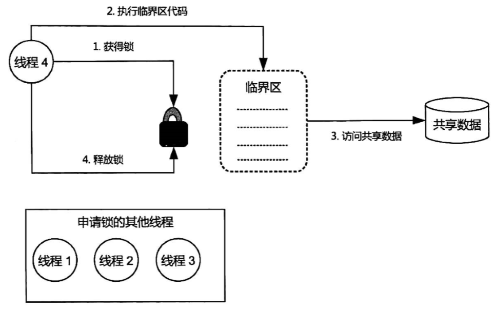
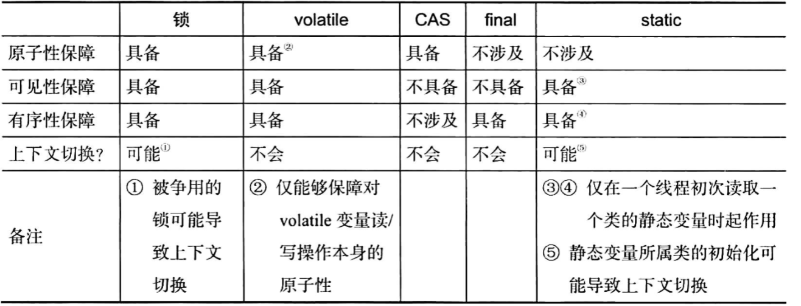

# 线程同步机制

线程同步机制：指一套用于协调线程间数据访问及活动的机制，用来保障线程安全以及实现这些线程的共同目标。包括锁、volatile关键字、final关键字、static关键字以及相关的api，如Object.wait()/Object.notify()等。

## 锁

锁，对共享数据访问的许可证。

- 一个线程在访问线程之前必须先申请相应的锁，这个过程称为**锁的获得（Acquire）**；
- 一个线程获得某个锁，一个锁一次只能被一个线程持有，获得锁的线程称为**相应锁的持有线程**；
- 锁的持有者可以对数据进行访问，访问完成后必须**释放（Release）相应的锁**；
- 锁的持有线程获得锁之后和释放锁之前这段时间执行的代码被称为**临界区**；
- 如果有多个线程访问同一个锁所保护的共享数据，就称这些**线程同步在这个锁上**；或者称我们对这些线程所进行的共享数据访问进行加锁；相应的，这些线程所执行的临界区被称为这个**锁所引导的临界区**。

锁的适用场景：

- check-then-act
- read-modify-write
- 多个线程对多个共享数据进行更新

锁的重排序规则：

- 临界区内、临界区外的代码可以在各自的区域重排序；
- 临界区外的代码相对于临界区内的代码”许进不许出“；

### 锁的分类

#### 排他锁/互斥锁

锁具有排他性，即一个锁一次只能被一个线程持有，这种锁被称为排他锁/互斥锁（Mutex）。

- 原子性：通过互斥，将并发转为串行（即一次只能有一个线程访问临界区，且临界区执行时没有别的线程访问相应的共享数据），实现了原子性；
- 可见性：可见性的保障由写线程冲刷处理器缓存和读线程刷新处理器缓存两个动作实现，在Java中，锁的获得隐含刷新处理器缓存这个动作，锁的释放隐含冲刷处理器缓存的动作，保障了可见性；
- 有序性：临界区的任意操作可以在临界区内被重排，不会排到临界区外，保障了有序性。
- 前提：
  - 访问同一组共享数据的多个线程必须同步在同一锁上；
  - 并且即使是仅仅对共享数据进行读取（而没有更新）的访问也要加锁。

按Java虚拟机划分：

- 内部锁（Intrinsic Lock）：synchronized关键字实现；
- 显示锁（Explicit Lock）：java.concurrent.locks.Lock接口的实现类实现；

互斥锁示意图：



**锁相关概念：**

1. 可重入性（Reentrancy）：一个线程在其持有一个锁的时候能否再次或多次申请该锁，能即称该锁为**可重入锁**，不能就为**非可重入锁**。
2. 锁的争用与调度：公平锁与非公平锁；
   - 内部锁：非公平锁；
   - 显示锁：即支持公平锁，又支持非公平锁。
3. 锁的粒度：一个锁实例所保护的共享数据的大小称为锁的粒度。
4. 锁的开销：主要包括锁申请、锁释放、可能导致的上下文切换的开销。

##### 内部锁

Java平台中的任意一个对象都有唯一一个与之关联的锁，这种锁被称为监视器（Monitor）或内部锁（Intrinsic Lock）。

- 内部锁属于排他锁，能够保障三性；

- 通过synchronized关键字实现，该关键字能够修饰方法以及代码块；

- synchronized修饰的方法被称为同步方法：

  - 修饰的静态方法称为同步静态方法；
  - 修饰的实例方法称为同步实例方法；

- 修饰的代码块称为同步块，语法如下：

  ```java
  // 锁句柄表示一个对象的引用，或者能够返回对象的表达式
  //   比如this关键字表示当前对象
  // 锁句柄通常用private final修饰
  synchronized (锁句柄){
      // 在此代码块中访问共享数据
  }
  ```

- Java内部锁会为每个内部锁分配一个入口集（Entry Set），用于记录等待获取相应内部锁的线程。入口集中的线程被称为等待线程。

##### 显示锁

java.concurrent.locks.Lock接口的实例为显示锁。该接口对锁进行了抽象，默认实现：java.util.concurrent.locks.ReentrantLock.

java.concurrent.locks.Lock接口方法：

- void lock()：获取锁；
- void lockInterruptibly()：如果当前线程未被中断，则获取锁；
- Condition newCondition()：返回绑定到此Lock的新Condition实例；
- boolean tryLock()：仅在调用时锁为空闲状态才获取该锁；
- boolean tryLock(long time,TimeUnit unit)：如果锁在给定的等待时间内空闲，并且当前线程未被中断，则获取锁；
- void unlock()：释放锁。

显示锁的使用：

```java
// 1.创建一个Lock接口实例
private final Lock lock=new ReentrantLock(); 
// 2.申请锁lock
lock.lock();
try {
    // 3.在此对共享数据进行访问
}
finally {
	// 4.总是在finally块中释放锁，以免锁泄露
    lock.unlock();
}
```

显示锁的调度：

ReentrantLock(boolean fair)：true为公平锁，false为非公平。

tryLock()使用的模板代码：

```java
Lock lock=new ReentrantLock();
if(lock.tryLock()){
    try {
        // 在此访问共享变量
    }
    finally {
        lock.unlock();
    }
}else{
    // 执行其他操作
}
```

#### 读写锁

对于同步在同一锁上的线程而言，对共享变量仅进行读取而没有更新的线程称为只读线程；对共享变量进行更新（包括先读取后更新）的线程就被称为写线程。

读写锁（Read/Write Lock）：允许多个线程可以同时读取（只读）共享变量，但是一次只允许一个线程对共享变量进行更新（包括读取后更新）。

- 任何线程读取共享变量的时候，其他线程无法更新这些变量；
- 一个线程更新共享变量的时候，其他任何线程无法访问该变量。

两种角色：

|      | 获得条件                                                     | 排他性                     | 作用                                                         |
| ---- | ------------------------------------------------------------ | -------------------------- | ------------------------------------------------------------ |
| 读锁 | 相应的写锁未被任何线程持有                                   | 对读线程共享，对写线程排他 | 允许多个读线程可以同时读取变量，并保障读线程读取共享变量期间没有其他任何线程能够更新这些共享变量 |
| 写锁 | 该写锁违背其他任何线程持有并且相应的读锁未被任何其他线程持有 | 对读写线程都是排他的       | 使得写线程能够以独占的方式访问共享变量                       |

java.util.concurrent.locks.ReadWriteLock接口是对读写锁的抽象，默认实现类：java.util.concurrent.locks.ReentrantReadWriteLock。该接口定义了两个方法readLock()和writeLock()，分别用于返回相应读写锁实例的读锁与写锁。两个方法的返回值均为Lock。

```java
private final ReadWriteLock rwLock=new ReentrantReadWriteLock();
private final Lock rLock=rwLock.readLock();
private final Lock wLock=rwLock.writeLock();

// 读线程执行方法
public void reader(){
    rLock.lock(); // 申请读锁
    try {
        // 在此区域读取共享变量
    }finally {
        // 在finally块中释放锁，避免泄露
        rLock.unlock();
    }
}
// 写线程执行方法
public void writer(){
    wLock.lock(); // 申请写锁
    try {
        // 在此区域访问（读写）共享变量
    }finally {
        // 在finally块中释放锁，避免泄露
        wLock.unlock();
    }
}
```

读写锁使用场景（读写锁开销大，只有满足以下条件才比较合适）：

- 只读操作比写操作（更新）要频繁的多；
- 读线程持有锁时间比较长；

ReentrantReadWriteLock是可重入锁，支持降级，即一个线程持有写锁的情况下可以继续获得相应的读锁：

```java
private final ReadWriteLock rwLock=new ReentrantReadWriteLock();
private final Lock rLock=rwLock.readLock();
private final Lock wLock=rwLock.writeLock();    
// 写线程执行方法
public void writer(){
    boolean readLockAcquired=false;
    wLock.lock(); // 申请写锁
    try {
        // 在此区域访问（读写）共享变量
        // 当前线程持有写锁，继续申请读锁
        rLock.lock();
        readLockAcquired=true;
    }finally {
        // 在finally块中释放锁，避免泄露
        wLock.unlock();
    }
    
    if(readLockAcquired){
        try {
            // 读取共享数据并执行其他操作
        }finally {
            // 释放读锁
            rLock.unlock();
        }
    }else{

    }
}
```

### 线程同步的底层助手

内存屏障：

可见性：

- 加载屏障：刷新处理器缓存
- 存储屏障：冲刷处理器缓存

有序性：

- 释放屏障
- 获取屏障

### 轻量级同步机制（volatile）

volatile关键字作用用来修饰共享可变变量，作用：

- 被修饰的变量读写操作都会在高速缓存或主内存（即内存访问），不会保存到寄存器；
- 能保障可见性、有序性，且能保障volatile变量操作的原子性；
- 不会引起上下文切换；

用途：

- 保障long/double变量读/写操作的原子性；

- volatile修饰的是数组时，volatile只能对数组本身引用的操作（读取数组引用和更新数组引用）起作用，而无法对数组元素的操作（读取、更新数组元素）起作用；想要对数组元素的读、写也能触发，可以使用AtomicIntegerArray、AtomicLongArray和AtomicReferenceArray；

- 使用volatile变量作为状态标志：在该场景中，应用程序的某个状态由一个线程设置，其他线程会读取该状态并作为其计算的依据；

- 使用volatile保障可见性；

- 代替锁；

- 实现简易版读写锁

  ```java
  private volatile long count;
  
  public long value(){
      return count;
  }
  public void increment(){
      synchronized (this){
          count++;
      }
  }
  ```

#### 利用volatile实现单例模式

```java
// 单例模式：保持一个类有且只有一个实例

// 1. 使用延迟加载
// 在多线程环境下，getInstance()的if语句形成了check-then-act操作，
// 该操作不是原子操作
public class SingleThreadSingleton {
    // 保存该类唯一实例
    private static SingleThreadSingleton instance=null;

    // 私有构造器保证其他类无法直接通过new创建
    private SingleThreadSingleton() {
    }

    // 创建并返回该类唯一实例
    // 即只有该方法被调用时该类的唯一实例才会被创建
    public static SingleThreadSingleton getInstance(){
        if(null==instance){ // 操作1
            instance=new SingleThreadSingleton(); // 操作2
        }
        return instance;
    }
}

// 2. 加锁版
// 是线程安全的，然而每次访问都需要申请锁，开销太大
public class SingleThreadSingleton {
    // 保存该类唯一实例
    private static SingleThreadSingleton instance=null;

    // 私有构造器保证其他类无法直接通过new创建
    private SingleThreadSingleton() {
    }

    // 创建并返回该类唯一实例
    // 即只有该方法被调用时该类的唯一实例才会被创建
    public static SingleThreadSingleton getInstance(){
        synchronized (SingleThreadSingleton.class) {
            if (null == instance) {
                instance = new SingleThreadSingleton();
            }
            return instance;
        }
    }
}

// 3. 在加锁前进行判断
// 双重加锁
public class SingleThreadSingleton {
    // 保存该类唯一实例
    private static volatile SingleThreadSingleton instance=null;

    // 私有构造器保证其他类无法直接通过new创建
    private SingleThreadSingleton() {
    }

    // 创建并返回该类唯一实例
    // 即只有该方法被调用时该类的唯一实例才会被创建
    public static SingleThreadSingleton getInstance(){
        if(null==instance) {
            synchronized (SingleThreadSingleton.class) {
                if (null == instance) {
                    instance = new SingleThreadSingleton();
                }
                return instance;
            }
        }
    }
}

// 4.基于静态内部类的单例模式实现
// 类的静态变量被初次访问时会触发Java虚拟机对该类进行初始化，即该类的静态变量的值会变为初始值而不是默认值。
public class StaticHolderSingleton {
    // 私有构造
    private StaticHolderSingleton(){}
    private static class InstanceHolder{
        // 保存外部类的唯一实例
        final static StaticHolderSingleton INSTANCE=
            new StaticHolderSingleton();
    }
    public static StaticHolderSingleton getInstance(){
        return InstanceHolder.INSTANCE;
    }  
}

// 5. 利用枚举实现类型
public class EnumBasedSingletonExample {
    // 相当于一个单例类，其字段INSTANCE相当于该类的唯一实例
    public static enum Singleton{
        INSTANCE;
        Singleton(){
            System.out.println("创建成功");
        }
        public void service(){
            System.out.println("Hello World");
        }
    }

    public static void main(String[] args) {
        new Thread(()->{
            // 不会导致Singleton的实例化
            System.out.println(Singleton.class.getName());
            // Singleton实例化
            Singleton.INSTANCE.service();
        }).start();
        Singleton.INSTANCE.service();
    }
}
```

## CAS与原子变量

CAS（Compare and Swap）是对一种处理器指令的称呼。CAS是一个if-then-act的操作。

- 保障操作的原子性；
- 不能保障可见性；
- 不会导致上下文切换；
- ABA问题及规避

### 原子操作工具：原子变量类

原子变量类（Atomics）是基于CAS实现的能够保障对共享变量进行read-modify-write更新操作的原子类和可见性的一组工具类。

原子变量类 **比锁的粒度更细，更轻量级**，并且对于在多处理器系统上实现高性能的并发代码来说是非常关键的。原子变量将发生竞争的范围缩小到单个变量上。

原子变量类相当于一种泛化的 `volatile` 变量，能够**支持原子的、有条件的读/改/写操**作。

原子类在内部使用 CAS 指令（基于硬件的支持）来实现同步。这些指令通常比锁更快。

原子变量类可以分为 4 组：

- 基本类型
  - `AtomicBoolean` - 布尔类型原子类
  - `AtomicInteger` - 整型原子类
  - `AtomicLong` - 长整型原子类
- 引用类型
  - `AtomicReference` - 引用类型原子类
  - `AtomicMarkableReference` - 带有标记位的引用类型原子类
  - `AtomicStampedReference` - 带有版本号的引用类型原子类
- 数组类型
  - `AtomicIntegerArray` - 整形数组原子类
  - `AtomicLongArray` - 长整型数组原子类
  - `AtomicReferenceArray` - 引用类型数组原子类
- 属性更新器类型
  - `AtomicIntegerFieldUpdater` - 整型字段的原子更新器。
  - `AtomicLongFieldUpdater` - 长整型字段的原子更新器。
  - `AtomicReferenceFieldUpdater` - 原子更新引用类型里的字段。

AtomicInteger方法：

```
public final int get() // 获取当前值
public final int getAndSet(int newValue) // 获取当前值，并设置新值
public final int getAndIncrement()// 获取当前值，并自增
public final int getAndDecrement() // 获取当前值，并自减
public final int getAndAdd(int delta) // 获取当前值，并加上预期值
boolean compareAndSet(int expect, int update) // 如果输入值（update）等于预期值，将该值设置为输入值
public final void lazySet(int newValue) // 最终设置为 newValue，使用 lazySet 设置之后可能导致其他线程在之后的一小段时间内还是可以读到旧的值。
```

CAS的ABA问题：共享变量的当前值与当前线程提供的旧值相同，就认为该变量没有被其他线程修改过，实际上不一定成立，比如对于共享变量V，在当前线程看到它的值为A的那一刻，其他线程已将其值更新为B，接着当前线程执行CAS时，该变量又被其他线程更新为A，这就是CBS的ABA问题。

规避ABA问题：引入修订时间戳，将共享变量的值扩展为一个由实际值与修订时间戳的元组。AtomicStampedReference就是基于这种思想产生的。

## 对象的发布与逸出

对象发布：使对象能够被其作用域之外的线程访问，对象发布方法：

1. 将对象引用存储到public变量-----不推荐使用；
2. 在非private方法中返回一个对象；
3. 创建内部类，使得当前对象（this）能够被这个内部类使用；
4. 通过方法调用将对象传递给外部方法；

### 对象的初始化

Java中类的初始化采用了延迟加载的技术，即一个类被java虚拟机加载之后，该类的所有静态变量的值都仍然是其默认值（引用为null，boolean为false），直到有个线程初次访问了该类的任意一个静态变量才使这个类被初始化-----类的静态初始化块（"static{}")被执行，类的所有静态变量被赋予初始值。

```
public class ClassLazyInitDemo {
    static class Collaborator{
        static int num=1;
        static boolean flag=true;
        static {
            System.out.println("Collaborator Init");
        }
    }
    public static void main(String[] args) {
        System.out.println(Collaborator.class.hashCode());
        System.out.println(Collaborator.num);
        System.out.println(Collaborator.flag);
    }
}
// 输出
460141958
Collaborator Init
1
true
```

final和static在多线程环境下能够保证线程读到相应字段的初始值（而不是默认值），static变量不保证能读取到相对新值。

