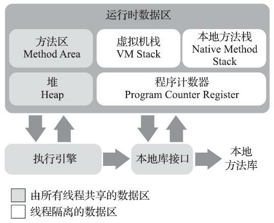

## 运行时数据区域

Java虚拟机在执行Java程序的过程中会把它所管理的内存划分为若干个不同的数据区域。这些区域有各自的用途，以及创建和销毁的时间，有的区域随着虚拟机进程的启动而一直存在，有些区域则是依赖用户线程的启动和结束而建立和销毁。根据《Java虚拟机规范》的规定，Java虚拟机所管理的内存将会包括以下几个运行时数据区域：

### 程序计数器

程序计数器（Program Counter Register）是一块较小的内存空间，它可以看作是当前线程所执行的字节码的行号指示器。

> 在Java虚拟机的概念模型里，字节码解释器工作时就是通过改变这个计数器的值来选取下一条需要执行的字节码指令，它是程序控制流的指示器，分支、循环、跳转、异常处理、线程恢复等基础功能都需要依赖这个计数器来完成。
>
> 概念模型：代表了所有虚拟机的统一外观，但不同虚拟机并不一定按照概念模型来设计，可能会通过更高效率的等价方式去实现。

由于Java虚拟机的多线程是通过线程轮流切换、分配处理器执行时间的方式来实现的，在任何一个确定的时刻，一个处理器（对于多核处理器来说是一个内核）都只会执行一条线程中的指令。因此，为了线程切换后能恢复到正确的执行位置，每条线程都需要有一个独立的程序计数器，各条线程之间计数器互不影响，独立存储，我们称这类内存区域为**“线程私有”**的内存。

> 如果线程正在执行的是一个Java方法，这个计数器记录的是正在执行的虚拟机字节码指令的地址；如果正在执行的是本地（Native）方法，这个计数器值则应为空Undefined）。此内存区域是唯一一个在《Java虚拟机规范》中没有规定任何OutOfM emoryError情况的区域。

### 虚拟机栈

虚拟机栈（Java Virtual Machine Stack）描述的是Java方法执行的线程内存模型：

- 每个方法被执行的时候，Java虚拟机都会同步创建一个栈帧（Stack Frame：栈帧是方法运行期很重要的基础数据结构）用于存储局部变量表、操作数栈、动态连接、方法出口等信息。
- 每一个方法被调用直至执行完毕的过程，就对应着一个栈帧在虚拟机栈中从入栈到出栈的过程。

- **线程私有**，生命周期与线程相同

#### 虚拟机栈中的局部变量表

- 存放了编译期可知的各种Java虚拟机的以下数据类型：
  - 基本数据类型（boolean、byte、char、short、int、float、long、double）
  - 对象引用（reference类型，它并不等同于对象本身，可能是一个指向对象起始地址的引用指针，也可能是指向一个代表对象的句柄或者其他与此对象相关的位置）
  - returnAddress类型（指向了一条字节码指令的地址）

- 这类数据类型在局部变量表中的存储空间以局部变量槽（Slot）来表示，其中，64位长度的long和double类型的数据会占用两个变量槽，其余数据类型只占2一个。
- 局部变量表所需的内存空间在编译期间完成分配，当进入一个方法时，这个方法需要在栈帧中分配多大的局部变量空间是完全确定的，在方法运行期间不会改变局部变量表的大小（此大小仅指变量槽的数目，实际使用的内存空间由不同的虚拟机自行决定）。
- 《Java虚拟机规范》对该内存区域规定了两类异常：
  - 如果线程请求的栈深度大于虚拟机所允许的深度，将抛出stackOverflowError异常；
  - 如果Java虚拟机栈容量可以动态扩展，当栈扩展时无法申请到足够的内存会抛出OutOfMemoryError异常。（HotSpot虚拟机栈容量不可以动态扩展，所以不会出现由于无法扩展出现OOM异常，但在申请时就失败，会出现OOM异常）

### 本地方法栈

本地方法栈（Native M ethod Stacks）与虚拟机栈所发挥的作用是非常相似的，其区别只是虚拟机栈为虚拟机执行Java方法（也就是字节码）服务，而本地方法栈则是为虚拟机使用到的本地（Native）方法服务。

> 本地方法栈也会在栈深度溢出或者栈扩展失败时分别抛出StackOverflowError和OutOfM emoryError异常。

### Java堆

Java堆（Java Heap）是虚拟机管理的内存中最大的一块，具有以下特点：

- **所有线程共享**的一块内存区域；
- 创建的唯一目的：存放对象实例
- 如果从分配内存的角度看，所有线程共享的Java堆中可以划分出多个线程私有的分配缓冲区（Thread Local Allocation Buffer，TLAB），以提升对象分配时的效率
- 可以是固定大小的，也可以是可扩展的，主流虚拟机都是可扩展的（通过参数-Xmx和-Xms设定）
- 在堆中没有内存完成实例分配，并且堆也无法再扩展时，抛出OOM异常
- 是gc（垃圾收集器）管理的内存区域

### 方法区

方法区（Method Area）：**各个线程共享**，用于存储已被虚拟机加载的类型信息、常量、静态变量、即时编译器编译后的代码缓存等数据。虽然《Java虚拟机规范》中把方法区描述为堆的一个逻辑部分，但是它却有一个别名叫作“非堆”（Non-Heap），目的是与Java堆区分开来。当方法区无法满足新的内存分配需求时，抛出OOM异常。

- 在jdk7之前，这些信息放在了永久代，方便gc管理；
- jdk7，将原本放在永久代的字符串常量池、静态变量等移出；
- jdk8之后，将永久代的字符串常量池、静态变量、类型信息等放在了元空间（Meta-space)中

#### 运行时常量池

运行时常量池（Runtime Constant Pool）是方法区的一部分，受到方法区内存的限制，当常量池无法申请到内存时抛出OOM异常。

- Class文件中除了有类的版本、字段、方法、接口等描述信息外，还有一项信息是**常量池表（Constant Pool Table）**，用于存放编译期生成的各种字面量与符号引用，这部分内容将在类加载后存放到方法区的运行时常量池中。

- 运行时常量池相对于Class文件常量池的另外一个重要特征是具备动态性，Java语言并不要求常量一定只有编译期才能产生，也就是说，并非预置入Class文件中常量池的内容才能进入方法区运行时常量池，运行期间也可以将新的常量放入池中，这种特性被开发人员利用得比较多的便是String类的intern()方法。

### 直接内存

直接内存（Direct M emory）并不是虚拟机运行时数据区的一部分，也不是《Java虚拟机规范》中定义的内存区域。

在JDK1.4中加入了NIO（New Input/Output）类，引入了一种基于通道的（Channel）与缓冲区（Buffer）的I/O方式，可以使Native函数库直接分配堆外内存，然后通过一个存储在Java堆里面的DirectByteBuffer对象作为这块内存的引用进行操作。这样能在一些场景中显著提高性能，因为避免了在Java堆和Native堆中来回复制数据。

本机直接内存的分配不会受到Java堆大小的限制，但是，既然是内存，则肯定还是会受到本机总内存（包括物理内存、SWAP分区或者分页文件）大小以及处理器寻址空间的限制，一般服务器管理员配置虚拟机参数时，会根据实际内存去设置-Xmx等参数信息，但经常忽略掉直接内存，使得各个内存区域总和大于物理内存限制（包括物理的和操作系统级的限制），从而导致动态扩展时出现OOM异常。

