# HTTP协议

HTTP（全称超文本传输协议，英文全称HyperText Transfer Protocol）是互联网上应用最为广泛的一种网络协议。所有的WWW文件都必须遵守这个标准。设计HTTP最初的目的是为了提供一种发布和接收HTML页面的方法。

对于移动端即时通讯（尤其IM应用）来说，现今主流的数据通信总结下来无外乎就是长连接+短连接的方式，而短连接在应用上讲就是本文将要介绍的HTTP协议的应用，而而正确地理解HTTP协议对于写好IM来说，是相当有益的（关于移动端的HTTP具体应用情况，可以阅读《[现代移动端网络短连接的优化手段总结：请求速度、弱网适应、安全保障](http://www.52im.net/thread-1413-1-1.html)》）。


## 计算机分层


## TCP/IP通讯流传输

利用 TCP/IP 协议族进行网络通信时，会通过分层顺序与对方进行通信。发送端从应用层往下走，接收端则从链路层往上走。


- 首先作为发送端的客户端在应用层（HTTP 协议）发出一个想看某个 Web 页面的 HTTP 请求；
- 接着，为了传输方便，在传输层（TCP 协议）把从应用层处收到的数据（HTTP 请求报文）进行分割，并在各个报文上打上标记序号及端口号后转发给网络层；
- 在网络层（IP 协议），增加作为通信目的地的 MAC 地址后转发给链路层。这样一来，发往网络的通信请求就准备齐全了；
- 接收端的服务器在链路层接收到数据，按序往上层发送，一直到应用层。当传输到应用层，才能算真正接收到由客户端发送过来的 HTTP请求。

HTTP请求：

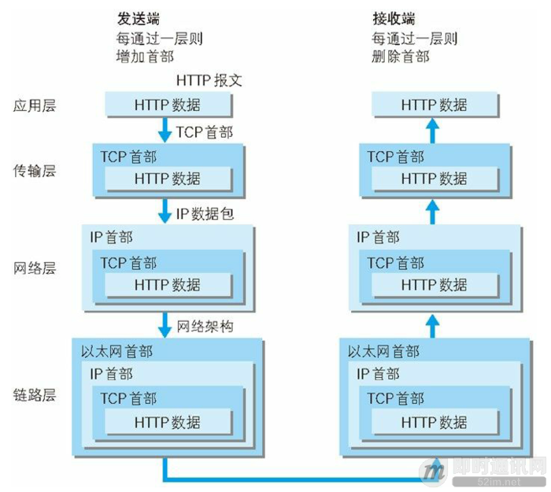

## HTTP工作流程

- ***1）***建立 TCP 连接：在HTTP工作开始之前，客户端首先要通过网络与服务器建立连接，该连接是通过 TCP 来完成的，该协议与 IP 协议共同构建 Internet，即著名的 TCP/IP 协议族，因此 Internet 又被称作是  TCP/IP 网络。HTTP 是比 TCP 更高层次的应用层协议，根据规则，只有低层协议建立之后，才能进行高层协议的连接，因此，首先要建立  TCP 连接，一般 TCP 连接的端口号是80；
- ***2）***客户端向服务器发送请求命令：一旦建立了TCP连接，客户端就会向服务器发送请求命令；
   例如：GET/sample/hello.jsp HTTP/1.1；
- ***3）***客户端发送请求头信息：客户端发送其请求命令之后，还要以头信息的形式向服务器发送一些别的信息，之后客户端发送了一空白行来通知服务器，它已经结束了该头信息的发送；
- ***4）***服务器应答：客户端向服务器发出请求后，服务器会客户端返回响应；
   例如： HTTP/1.1 200 OK
   响应的第一部分是协议的版本号和响应状态码；
- ***5）***服务器返回响应头信息：正如客户端会随同请求发送关于自身的信息一样，服务器也会随同响应向用户发送关于它自己的数据及被请求的文档；
- ***6）***服务器向客户端发送数据：服务器向客户端发送头信息后，它会发送一个空白行来表示头信息的发送到此为结束，接着，它就以 Content-Type 响应头信息所描述的格式发送用户所请求的实际数据；
- ***7）***服务器关闭 TCP 连接：一般情况下，一旦服务器向客户端返回了请求数据，它就要关闭 TCP 连接，然后如果客户端或者服务器在其头信息加入了这行代码 Connection:keep-alive ，TCP  连接在发送后将仍然保持打开状态，于是，客户端可以继续通过相同的连接发送请求。保持连接节省了为每个请求建立新连接所需的时间，还节约了网络带宽。

## HTTP协议基础

1. 通过请求和响应的交换达成通信

   应用 HTTP 协议时，必定是一端担任客户端角色，另一端担任服务器端角色。仅从一条通信线路来说，服务器端和客服端的角色是确定的。HTTP  协议规定，请求从客户端发出，最后服务器端响应该请求并返回。换句话说，肯定是先从客户端开始建立通信的，服务器端在没有接收到请求之前不会发送响应。

2. HTTP 是不保存状态的协议

   HTTP 是一种无状态协议。协议自身不对请求和响应之间的通信状态进行保存。也就是说在 HTTP 这个级别，协议对于发送过的请求或响应都不做持久化处理。这是为了更快地处理大量事务，确保协议的可伸缩性，而特意把 HTTP 协议设计成如此简单的。
   可是随着 Web 的不断发展，我们的很多业务都需要对通信状态进行保存。于是我们引入了 Cookie 技术。有了 Cookie 再用 HTTP 协议通信，就可以管理状态了。

3. 使用 Cookie 的状态管理

   Cookie 技术通过在请求和响应报文中写入 Cookie 信息来控制客户端的状态。Cookie 会根据从服务器端发送的响应报文内的一个叫做  Set-Cookie 的首部字段信息，通知客户端保存Cookie。当下次客户端再往该服务器发送请求时，客户端会自动在请求报文中加入 Cookie 值后发送出去。服务器端发现客户端发送过来的 Cookie  后，会去检查究竟是从哪一个客户端发来的连接请求，然后对比服务器上的记录，最后得到之前的状态信息。

cookie流程：


4. 请求URI定位资源

   HTTP 协议使用 URI 定位互联网上的资源。正是因为 URI 的特定功能，在互联网上任意位置的资源都能访问到。

5. 告知服务器意图的HTTP方法（基于HTTP/1.1）

   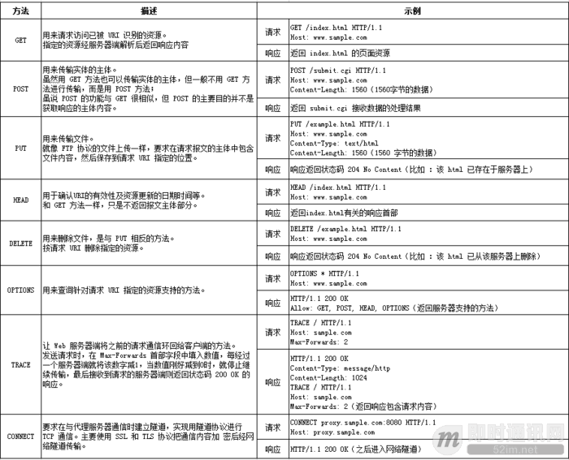

6. 持久连接

   HTTP 协议的初始版本中，每进行一个 HTTP 通信都要断开一次 TCP 连接。比如使用浏览器浏览一个包含多张图片的 HTML  页面时，在发送请求访问 HTML 页面资源的同时，也会请求该 HTML 页面里包含的其他资源。因此，每次的请求都会造成无畏的 TCP  连接建立和断开，增加通信量的开销。

    为了解决上述 TCP 连接的问题，HTTP/1.1 和部分 HTTP/1.0  想出了持久连接的方法。其特点是，只要任意一端没有明确提出断开连接，则保持 TCP 连接状态。旨在建立一次 TCP  连接后进行多次请求和响应的交互。在 HTTP/1.1 中，所有的连接默认都是持久连接。

7. 管线化

   持久连接使得多数请求以管线化方式发送成为可能。以前发送请求后需等待并接收到响应，才能发送下一个请求。管线化技术出现后，不用等待亦可发送下一个请求。这样就能做到同时并行发送多个请求，而不需要一个接一个地等待响应了。

    比如，当请求一个包含多张图片的 HTML 页面时，与挨个连接相比，用持久连接可以让请求更快结束。而管线化技术要比持久连接速度更快。请求数越多，时间差就越明显。

## HTTP报文结构

### HTTP报文

用于 HTTP 协议交互的信息被称为 HTTP 报文。请求端（客户端）的 HTTP 报文叫做请求报文；响应端（服务器端）的叫做响应报文。HTTP 报文本身是由多行（用 CR+LF 作换行符）数据构成的字符串文本。

### HTTP报文结构

HTTP 报文大致可分为报文首部和报文主体两部分。两者由最初出现的空行（CR+LF）来划分。通常，并不一定有报文主体。

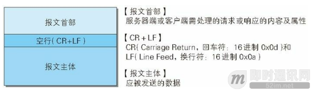

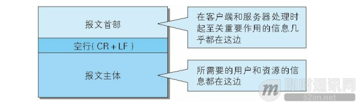

### 请求报文结构


**请求报文的首部内容由以下数据组成：**

- 请求行 —— 包含用于请求的方法、请求 URI 和 HTTP 版本；

- 首部字段 —— 包含表示请求的各种条件和属性的各类首部。（通用首部、请求首部、实体首部以及RFC里未定义的首部如 Cookie 等）。

**请求报文的示例，如下：**


### 响应报文结构

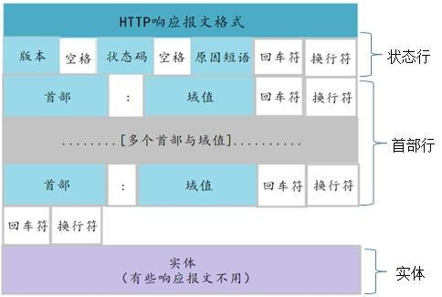

**响应报文的首部内容由以下数据组成：**

- 状态行 —— 包含表明响应结果的状态码、原因短语和 HTTP 版本；
- 首部字段 —— 包含表示请求的各种条件和属性的各类首部。（通用首部、响应首部、实体首部以及RFC里未定义的首部如 Cookie 等）。

**响应报文的示例，如下：**

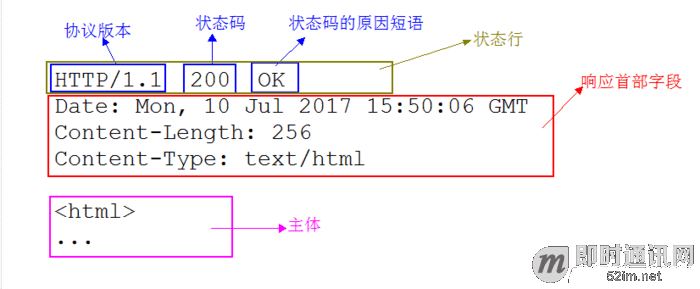

### HTTP 报文首部之首部字段（重点分析）

#### 概述

先来回顾一下首部字段在报文的位置，HTTP 报文包含报文首部和报文主体，报文首部包含请求行（或状态行）和首部字段。在报文众多的字段当中，HTTP 首部字段包含的信息最为丰富。首部字段同时存在于请求和响应报文内，并涵盖 HTTP 报文相关的内容信息。使用首部字段是为了给客服端和服务器端提供报文主体大小、所使用的语言、认证信息等内容。

#### 首部字段结构

- HTTP 首部字段是由首部字段名和字段值构成的，中间用冒号“：”分隔。
- 另外，字段值对应单个 HTTP 首部字段可以有多个值。
- 当 HTTP 报文首部中出现了两个或以上具有相同首部字段名的首部字段时，这种情况在规范内尚未明确，根据浏览器内部处理逻辑的不同，优先处理的顺序可能不同，结果可能并不一致。

#### 首部字段类型

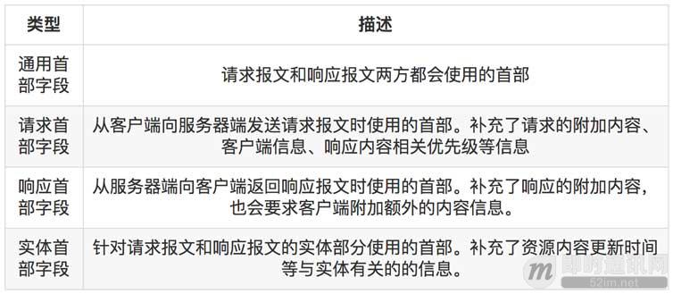

#### 通用首部字段（HTTP/1.1）


#### 请求首部字段（HTTP/1.1）

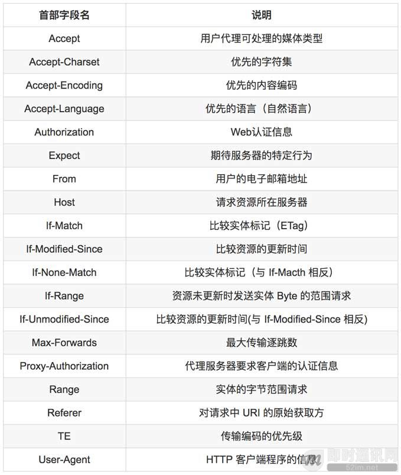

#### 响应首部字段（HTTP/1.1）

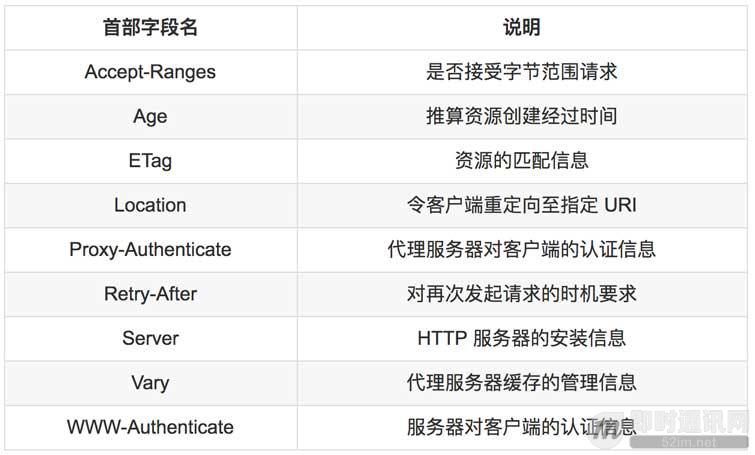

#### 实体首部字段（HTTP/1.1）

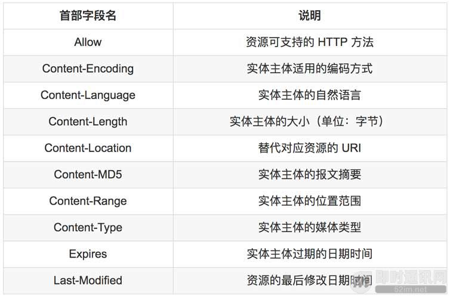

#### 为 Cookie 服务的首部字段

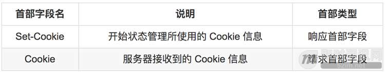

#### 其他首部字段

HTTP 首部字段是可以自行扩展的。所以在 Web 服务器和浏览器的应用上，会出现各种非标准的首部字段。以下是最为常用的首部字段。

**X-Frame-Options：**
X-Frame-Options: DENY 首部字段 X-Frame-Options 属于 HTTP 响应首部，用于控制网站内容在其他 Web 网站的 Frame  标签内的显示问题。其主要目的是为了防止点击劫持（clickjacking）攻击。首部字段 X-Frame-Options  有以下两个可指定的字段值：

- DENY：拒绝；
- SAMEORIGIN：仅同源域名下的页面（Top-level-browsing-context）匹配时许可。（比如，当指定 http://sample.com/sample.html 页面为 SAMEORIGIN 时，那么 sample.com 上所有页面的 frame 都被允许可加载该页面，而 example.com 等其他域名的页面就不行了）。

**X-XSS-Protection：**
X-XSS-Protection: 1 首部字段 X-XSS-Protection 属于 HTTP 响应首部，它是针对跨站脚本攻击（XSS）的一种对策，用于控制浏览器 XSS 防护机制的开关。首部字段 X-XSS-Protection 可指定的字段值如下:

- 0 ：将 XSS 过滤设置成无效状态
- 1 ：将 XSS 过滤设置成有效状态

**DNT：**
DNT: 1 首部字段 DNT 属于 HTTP 请求首部，其中 DNT 是 Do Not Track 的简称，意为拒绝个人信息被收集，是表示拒绝被精准广告追踪的一种方法。首部字段 DNT 可指定的字段值如下：

- 0 ：同意被追踪
- 1 ：拒绝被追踪


 由于首部字段 DNT 的功能具备有效性，所以 Web 服务器需要对 DNT做对应的支持。

**P3P：**
P3P: CP="CAO DSP LAW CURa ADMa DEVa TAIa PSAa PSDa IVAa IVDa OUR BUS IND 首部字段 P3P 属于 HTTP 响应首部，通过利用 P3P（The Platform for Privacy Preferences，在线隐私偏好平台）技术，可以让 Web 网站上的个人隐私变成一种仅供程序可理解的形式，以达到保护用户隐私的目的。

**要进行 P3P 的设定，需按以下操作步骤进行：**

- 步骤 1：创建 P3P 隐私
- 步骤 2：创建 P3P 隐私对照文件后，保存命名在 /w3c/p3p.xml
- 步骤 3：从 P3P 隐私中新建 Compact policies 后，输出到 HTTP 响应中

## HTTP 响应状态码

| **消息 **               | **描述**                                                     |
| ----------------------- | ------------------------------------------------------------ |
| 100 Continue            | 服务器仅接收到部分请求，但是一旦服务器并没有拒绝该请求，客户端应该继续发送其余的请求。 |
| 101 Switching Protocols | 服务器转换协议：服务器将遵从客户的请求转换到另外一种协议。   |

| **消息 **                         | **描述**                                                     |
| --------------------------------- | ------------------------------------------------------------ |
| 200 OK                            | 请求成功（其后是对GET和POST请求的应答文档。）                |
| 201 Created                       | 请求被创建完成，同时新的资源被创建。                         |
| 202 Accepted                      | 供处理的请求已被接受，但是处理未完成。                       |
| 203 Non-authoritative Information | 文档已经正常地返回，但一些应答头可能不正确，因为使用的是文档的拷贝。 |
| 204 No Content                    | 没有新文档。浏览器应该继续显示原来的文档。如果用户定期地刷新页面，而Servlet可以确定用户文档足够新，这个状态代码是很有用的。 |
| 205 Reset Content                 | 没有新文档。但浏览器应该重置它所显示的内容。用来强制浏览器清除表单输入内容。 |
| 206 Partial Content               | 客户发送了一个带有Range头的GET请求，服务器完成了它。         |

| **消息 **              | **描述**                                                     |
| ---------------------- | ------------------------------------------------------------ |
| 300 Multiple Choices   | 多重选择。链接列表。用户可以选择某链接到达目的地。最多允许五个地址。 |
| 301 Moved Permanently  | 所请求的页面已经转移至新的url。                              |
| 302 Found              | 所请求的页面已经临时转移至新的url。                          |
| 303 See Other          | 所请求的页面可在别的url下被找到。                            |
| 304 Not Modified       | 未按预期修改文档。客户端有缓冲的文档并发出了一个条件性的请求（一般是提供If-Modified-Since头表示客户只想比指定日期更新的文档）。服务器告诉客户，原来缓冲的文档还可以继续使用。 |
| 305 Use Proxy          | 客户请求的文档应该通过Location头所指明的代理服务器提取。     |
| 306 *Unused*           | 此代码被用于前一版本。目前已不再使用，但是代码依然被保留。   |
| 307 Temporary Redirect | 被请求的页面已经临时移至新的url。                            |

| **消息 **                           | **描述**                                                     |
| ----------------------------------- | ------------------------------------------------------------ |
| 400 Bad Request                     | 服务器未能理解请求。                                         |
| 401 Unauthorized                    | 被请求的页面需要用户名和密码。                               |
| 401.1                               | 登录失败。                                                   |
| 401.2                               | 服务器配置导致登录失败。                                     |
| 401.3                               | 由于 ACL 对资源的限制而未获得授权。                          |
| 401.4                               | 筛选器授权失败。                                             |
| 401.5                               | ISAPI/CGI 应用程序授权失败。                                 |
| 401.7                               | 访问被 Web 服务器上的 URL 授权策略拒绝。这个错误代码为 IIS 6.0 所专用。 |
| 402 Payment Required                | 此代码尚无法使用。                                           |
| 403 Forbidden                       | 对被请求页面的访问被禁止。                                   |
| 403.1                               | 执行访问被禁止。                                             |
| 403.2                               | 读访问被禁止。                                               |
| 403.3                               | 写访问被禁止。                                               |
| 403.4                               | 要求 SSL。                                                   |
| 403.5                               | 要求 SSL 128。                                               |
| 403.6                               | IP 地址被拒绝。                                              |
| 403.7                               | 要求客户端证书。                                             |
| 403.8                               | 站点访问被拒绝。                                             |
| 403.9                               | 用户数过多。                                                 |
| 403.10                              | 配置无效。                                                   |
| 403.11                              | 密码更改。                                                   |
| 403.12                              | 拒绝访问映射表。                                             |
| 403.13                              | 客户端证书被吊销。                                           |
| 403.14                              | 拒绝目录列表。                                               |
| 403.15                              | 超出客户端访问许可。                                         |
| 403.16                              | 客户端证书不受信任或无效。                                   |
| 403.17                              | 客户端证书已过期或尚未生效。                                 |
| 403.18                              | 在当前的应用程序池中不能执行所请求的 URL。这个错误代码为 IIS 6.0 所专用。 |
| 403.19                              | 不能为这个应用程序池中的客户端执行 CGI。这个错误代码为 IIS 6.0 所专用。 |
| 403.20                              | Passport 登录失败。这个错误代码为 IIS 6.0 所专用。           |
| 404 Not Found                       | 服务器无法找到被请求的页面。                                 |
| 404.0                               | （无）–没有找到文件或目录。                                  |
| 404.1                               | 无法在所请求的端口上访问 Web 站点。                          |
| 404.2                               | Web 服务扩展锁定策略阻止本请求。                             |
| 404.3                               | MIME 映射策略阻止本请求。                                    |
| 405 Method Not Allowed              | 请求中指定的方法不被允许。                                   |
| 406 Not Acceptable                  | 服务器生成的响应无法被客户端所接受。                         |
| 407 Proxy Authentication Required   | 用户必须首先使用代理服务器进行验证，这样请求才会被处理。     |
| 408 Request Timeout                 | 请求超出了服务器的等待时间。                                 |
| 409 Conflict                        | 由于冲突，请求无法被完成。                                   |
| 410 Gone                            | 被请求的页面不可用。                                         |
| 411 Length Required                 | "Content-Length" 未被定义。如果无此内容，服务器不会接受请求。 |
| 412 Precondition Failed             | 请求中的前提条件被服务器评估为失败。                         |
| 413 Request Entity Too Large        | 由于所请求的实体的太大，服务器不会接受请求。                 |
| 414 Request-url Too Long            | 由于url太长，服务器不会接受请求。当post请求被转换为带有很长的查询信息的get请求时，就会发生这种情况。 |
| 415 Unsupported Media Type          | 由于媒介类型不被支持，服务器不会接受请求。                   |
| 416 Requested Range Not Satisfiable | 服务器不能满足客户在请求中指定的Range头。                    |
| 417 Expectation Failed              | 执行失败。                                                   |
| 423                                 | 锁定的错误。                                                 |

| **消息 **                      | **描述**                                              |
| ------------------------------ | ----------------------------------------------------- |
| 500 Internal Server Error      | 请求未完成。服务器遇到不可预知的情况。                |
| 500.12                         | 应用程序正忙于在 Web 服务器上重新启动。               |
| 500.13                         | Web 服务器太忙。                                      |
| 500.15                         | 不允许直接请求 Global.asa。                           |
| 500.16                         | UNC 授权凭据不正确。这个错误代码为 IIS 6.0 所专用。   |
| 500.18                         | URL 授权存储不能打开。这个错误代码为 IIS 6.0 所专用。 |
| 500.100                        | 内部 ASP 错误。                                       |
| 501 Not Implemented            | 请求未完成。服务器不支持所请求的功能。                |
| 502 Bad Gateway                | 请求未完成。服务器从上游服务器收到一个无效的响应。    |
| 502.1                          | CGI 应用程序超时。　·                                 |
| 502.2                          | CGI 应用程序出错。                                    |
| 503 Service Unavailable        | 请求未完成。服务器临时过载或当机。                    |
| 504 Gateway Timeout            | 网关超时。                                            |
| 505 HTTP Version Not Supported | 服务器不支持请求中指明的HTTP协议版本。                |

## HTTP 报文实体

### 概述

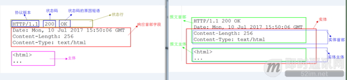

 HTTP 报文想象成因特网货运系统中的箱子，那么 HTTP 实体就是报文中实际的货物:

- 报文：是网络中交换和传输的数据单元，即站点一次性要发送的数据块。报文包含了将要发送的完整的数据信息，其长短很不一致，长度不限且可变；
- 实体：作为请求或响应的有效载荷数据（补充项）被传输，其内容由实体首部和实体主体组成。（实体首部相关内容在上面第六点中已有阐述。）

我们可以看到，上面示例右图中深红色框的内容就是报文的实体部分，而蓝色框的两部分内容分别就是实体首部和实体主体。而左图中粉红框内容就是报文主体。
通常，报文主体等于实体主体。只有当传输中进行编码操作时，实体主体的内容发生变化，才导致它和报文主体产生差异。

### 内容编码

HTTP 应用程序有时在发送之前需要对内容进行编码。例如，在把很大的 HTML 文档发送给通过慢速连接上来的客户端之前，服务器可能会对其进行压缩，这样有助于减少传输实体的时间。服务器还可以把内容搅乱或加密，以此来防止未授权的第三方看到文档的内容。

 这种类型的编码是在发送方应用到内容之上的。当内容经过内容编码后，编好码的数据就放在实体主体中，像往常一样发送给接收方。

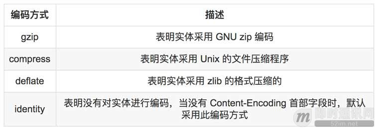

### 传输编码

内容编码是对报文的主体进行的可逆变换，是和内容的具体格式细节紧密相关的。

传输编码也是作用在实体主体上的可逆变换，但使用它们是由于架构方面的原因，同内容的格式无关。使用传输编码是为了改变报文中的数据在网络上传输的方式。

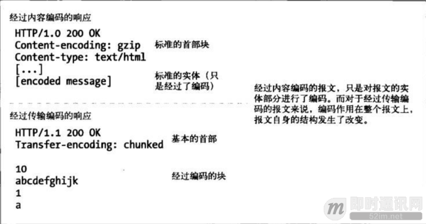

### 分块编码

分块编码把报文分割成若干已知大小的块。块之间是紧挨着发送的，这样就不需要在发送之前知道整个报文的大小了。分块编码是一种传输编码，是报文的属性。

 若客户端与服务器端之间不是持久连接，客户端就不需要知道它在读取的主体的长度，而只需要读取到服务器关闭主体连接为止。

当使用持久连接时，在服务器写主体之前，必须知道它的大小并在 Content-Length 首部中发送。如果服务器动态创建内容，就可能在发送之前无法知道主体的长度。
分块编码为这种困难提供了解决方案，只要允许服务器把主体分块发送，说明每块的大小就可以了。因为主体是动态创建的，服务器可以缓冲它的一部分，发送其大小和相应的块，然后在主体发送完之前重复这个过程。服务器可以用大小为 0 的块作为主体结束的信号，这样就可以继续保持连接，为下一个响应做准备。

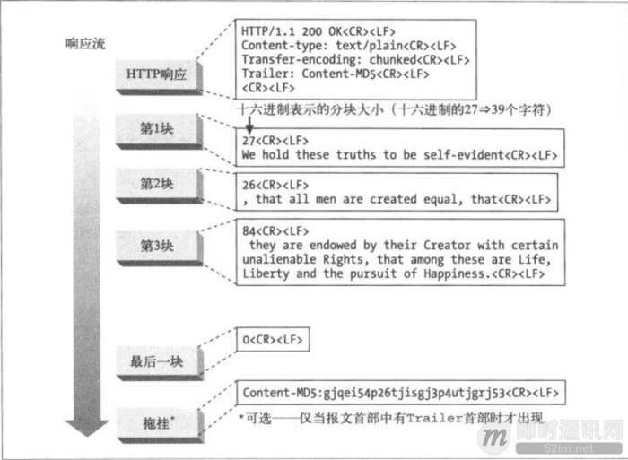

### 多部分媒体类型

MIME 中的 multipart（多部分）电子邮件报文中包含多个报文，它们合在一起作为单一的复杂报文发送。每一部分都是独立的，有各自的描述其内容的集，不同部分之间用分界字符串连接在一起。
相应得，HTTP 协议中也采纳了多部分对象集合，发送的一份报文主体内可包含多种类型实体。

**多部分对象集合包含的对象如下：**

- multipart/form-data：在 Web 表单文件上传时使用；
- multipart/byteranges：状态码 206 Partial Content 响应报文包含了多个范围的内容时使用。

### 范围请求

假设你正在下载一个很大的文件，已经下了四分之三，忽然网络中断了，那下载就必须重头再来一遍。为了解决这个问题，需要一种可恢复的机制，即能从之前下载中断处恢复下载。要实现该功能，这就要用到范围请求。

有了范围请求， HTTP 客户端可以通过请求曾获取失败的实体的一个范围（或者说一部分），来恢复下载该实体。当然这有一个前提，那就是从客户端上一次请求该实体到这一次发出范围请求的时间段内，该对象没有改变过。例如：

```
GET /bigfile.html HTTP/1.1
Host: [url=http://www.sample.com]www.sample.com[/url]
Range: bytes=20224-
···
```

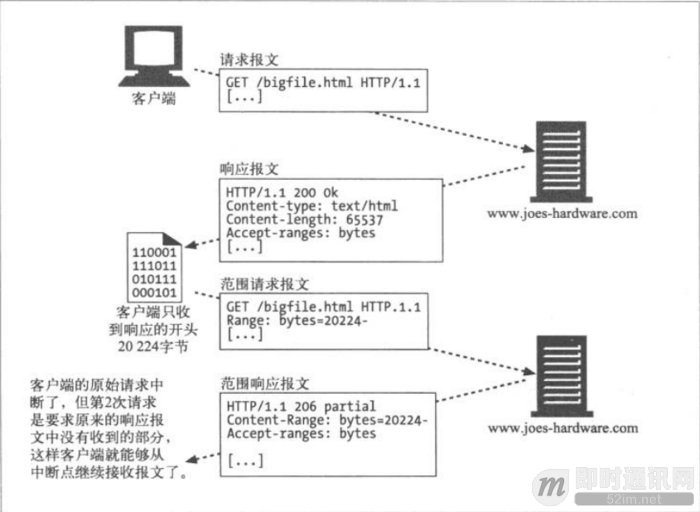

上面示例中，客户端请求的是文档开头20224字节之后的部分。

## 与 HTTP 协作的 Web 服务器

HTTP 通信时，除客户端和服务器外，还有一些用于协助通信的应用程序。如下列出比较重要的几个：代理、缓存、网关、隧道、Agent 代理。

### 代理

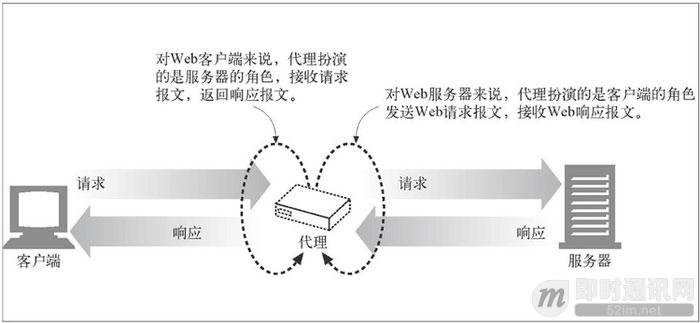

HTTP 代理服务器是 Web 安全、应用集成以及性能优化的重要组成模块。代理位于客户端和服务器端之间，接收客户端所有的 HTTP  请求，并将这些请求转发给服务器（可能会对请求进行修改之后再进行转发）。对用户来说，这些应用程序就是一个代理，代表用户访问服务器。

出于安全考虑，通常会将代理作为转发所有 Web 流量的可信任中间节点使用。代理还可以对请求和响应进行过滤，安全上网或绿色上网。

### 缓存

浏览器第一次请求：

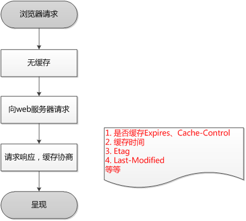

浏览器再次请求：

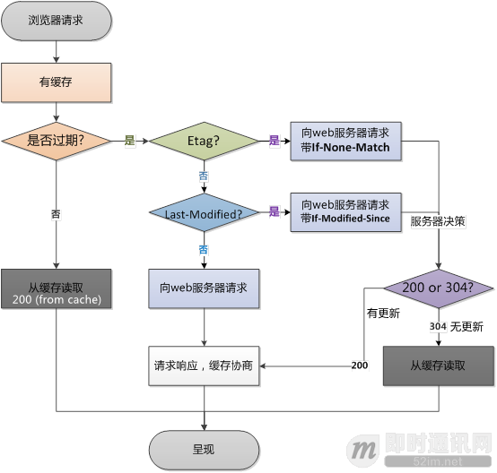

Web 缓存或代理缓存是一种特殊的 HTTP 代理服务器，可以将经过代理传输的常用文档复制保存起来。下一个请求同一文档的客户端就可以享受缓存的私有副本所提供的服务了。客户端从附近的缓存下载文档会比从远程 Web 服务器下载快得多。

### 网关

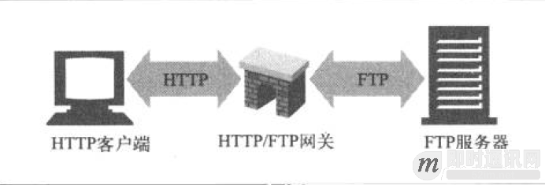

网关是一种特殊的服务器，作为其他服务器的中间实体使用。通常用于将 HTTP 流量转换成其他的协议。网关接收请求时就好像自己是资源的源服务器一样。客户端可能并不知道自己正在跟一个网关进行通信。

### 隧道

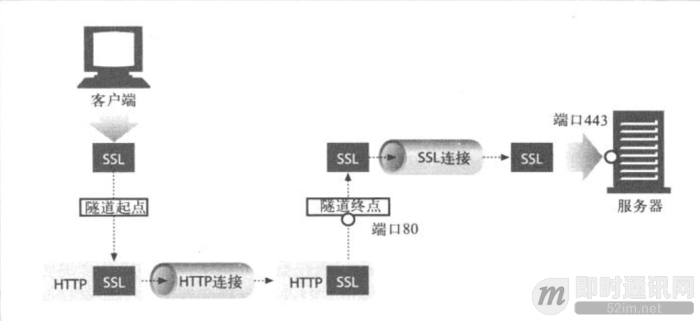

隧道是会在建立起来之后，就会在两条连接之间对原始数据进行盲转发的 HTTP 应用程序。HTTP 隧道通常用来在一条或多条 HTTP 连接上转发非 HTTP 数据，转发时不会窥探数据。
HTTP 隧道的一种常见用途就是通过 HTTP 连接承载加密的安全套接字层（SSL）流量，这样 SSL 流量就可以穿过只允许 Web 流量通过的防火墙了。

### Agent 代理

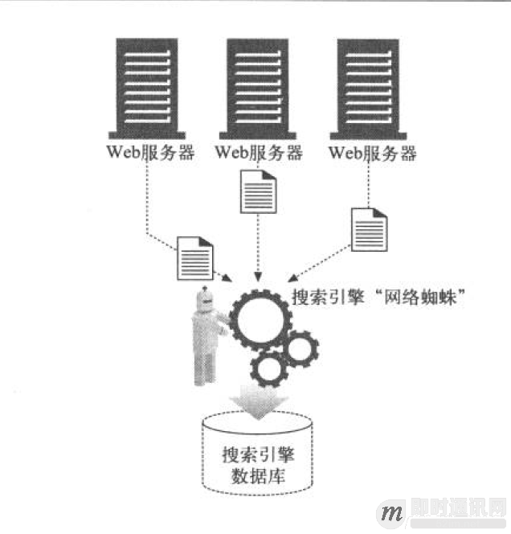

Agent 代理是代表用户发起 HTTP 请求的客户端应用程序。所有发布 Web 请求的应用程序都是 HTTP Agent 代理。

原文链接：[https://www.jianshu.com/p/6e9e4156ece3](https://www.jianshu.com/p/6e9e4156ece3)

