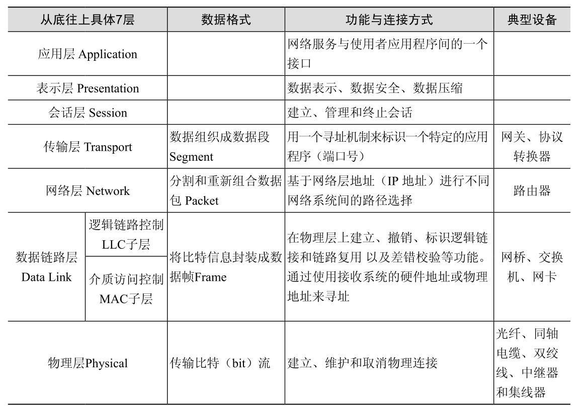

## 以太网和dos命令



### 以太网

局域网要解决的问题：多台主机在网络上【发言】时，在任何一个时刻，让谁先发言的问题。

#### 以太网访问特征

- 共享介质信道，公平的保障信道上的工作站均能控制信道的发送和接受；

  > 以太网中所有的站点共享一个通信信道，在发送数据的时候，站点将自己要发送的数据帧在这个信道上进行广播，以太网上的所有其他站点都能够接收到这个帧，他们通过比较自己的MAC地址和数据帧中包含的目的地MAC地址来判断该帧是否是发往自己的，一旦确认是发给自己的，则复制该帧做进一步处理。

- 公平竞争性介质访问方法；

  >因为多个站点可以同时向网络上发送数据，在以太网中使用了CSMA/CD协议来减少和避免冲突。需要发送数据的工作站要先侦听网络上是否有数据在发送，如果有的只有检测到网络空闲时，工作站才能发送数据。当两个工作站发现网络空闲而同时发出数据时，就会发生冲突。这时，两个站点的传送操作都遭到破坏，工作站进行1-坚持退避操作。退避时间的长短遵照二进制指数随机时间退避算法来确定。

#### 以太网的帧格式

以太网中的帧格式：定义了站点如何解释从物理层传来的二进制串，即如何在收到的数据帧中分离出各个不同含义的字段。存在多种帧格式，包括了DIX(DEC，Intel，Xerox三家公司)和IEEE 802．3分别定义的不同的几种帧格式。TCP/IP中使用的是DIX于1982年定义的Ethernet V2标准中所定义的帧格式，它是以太网的事实标准。

Ethernet V2帧结构包括6字节的源站MAC地址、6字节的目标站点MAC地址、2字节的协议类型字段、数据字段以及帧校验字段，MAC地址是一个六个字节长的二进制序列，全球唯一的标识了一个网卡。

以太网帧中各个字段含义如下：

1. 前同步信号字段。包括七个字节的同步符和一个的起始符。同步字符是由7个0和1交替的字节组成，而起始符是三对交替的0和1加上一对连续的l组成的一个字节。这个字段其实是物理层的内容，其长度并不计算在以太网长度里面。前同步信号用于在网络中通知其他站点的网卡建立位同步，同时告知网络中将有一个数据帧要发送。
2. 目的站点地址。目的站点的MAC地址，用于通知网络中的接收站点。目的占地MAC地址的左数第一位如果是0，表明目标对象是一个单一的站点，如果是1表明接收对象是一组站点，左数第二位为0表示该MAC地址是由IEEE组织统一分配的，为1表明该地址是自行分配的。
3. 源站地址。帧中包含的发送帧的站点的MAC地址，这是一个6字节的全球唯一的二进制序列，并且最左的一位永远是0。
4. 协议类型字段。以太网帧中的16位的协议类型的字段用于标识数据字段中包含的高级网络协议的类型，如TCP、IP、ARP、IPX等。
5. 数据字段。数据字段包含了来自上层协议的数据，是以太帧的有效载荷部分。为了达到最小帧长，数据字段的长度至少应该为46字节，等于最小帧长减去源地址和目的地址帧校验序列以及协议类型字段等的长度。同时以太网规定了数据字段的最大长度为1500字节。
6. 帧校验字段。帧校验字段是一个32位的循环冗余校验码，校验的范围不包括前同步字段。 

####  以太网交换机

二层交换机：在操作过程中不断收集资料，建立本身的地址表，主要用来记录每个MAC地址在哪个端口上被发现。当交换机接受到一个数据包时，会检查该数据包的目的地址，检索一下自己的地址表，并决定把数据包从哪个端口发送出去。

与HUB不一样的是，hub组成的共享式以太网，某个站点发送的数据会出现在HUB所有端口上（不管是否为其所需），效率差，安全性低。

广播风暴：多个二层设备用以太网线连接起来，称为级联，二层交换网络上的所有设备都会收到广播消息。如果这个以太网太大，泛滥的广播信息会造成网络效率大幅降低。

解决广播风暴的办法：在二层交换网络范围内进一步划分多个虚拟机的局域网（VLAN）。按照一定的逻辑关系将主机划分为若干群组，这种群组是逻辑组，和主机所在的物理位置无关。划分VLAN后，在同一以太网但在不同的VLAN中，通信必须经过路由设备（路由器或三层交换机进行）。

三层交换机是在二层交换机上增加三层路由的功能。三层交换机与路由器的区别：三层交换机的路由查找是针对流的，采用高速缓存技术，在成本不高的情况下实现快速转发；而传统路由器转发采用最长匹配的方式，实现复杂，效率较低。

#### 路由器

路由器是组成IP网络最主要的选路设备。

- 转发原始数据包；
- 信息中转站，将不同制式的网络连接在一起；
- 动态路由：按照一定规则更新路由表的行为；

#### 防火墙

作用：外部网络与内部网络之间，防止未授权的数据包进入私有领地。

### TCP/IP

#### MAC

Media Access Control：媒体访问控制。以太网的每一个节点（网卡、交换机、路由器的每个端口）都有一个MAC地址，由IEEE管理，由设备商固化在设备中。

MAC地址长度48位，6个字节，前24位表示设备商标识符，后24位是设备商自行分配的序列号。经常表示为12位的十六进制数。

查看本机MAC地址：Windows系统：ipconfig /all或ipconfig -all

静态IP地址与MAC地址捆绑：arp命令

#### 基本命令

- ping +IP地址：检查网络是否通畅；

- tracert +IP地址（Linux中叫Traceroute）：打印处一系列数据，包括所经过的路由设备的域名及IP地址，以及三个反馈包在路上所花费的时间；

- netstat：

  - -r：显示本机路由表的内容；
  - -s：显示每个协议的使用状态，包括TCP、UDP、IP协议；
  - -n：以数字表格形式显示地址和端口；
  - -a：显示所有主机的端口号；

- arp：IP层的协议

  - -a：显示所有的arp表项；
  - -s：在arp缓存中添加一条记录；
  - -d：在arp缓存中删除一条记录；

- route：用于本地IP卤藕表中显示和修改条目，手动静态配置路由表

  - print：显示IP路由表的完整内容；

  - add：增加一条路由记录（重启后丢失）

  - -p add：永久增加一条路由记录；

    ```
    # 添加默认网关地址为192.168.12.1的路由：
    route add 0.0.0.0 mask 0.0.0.0 192.168.12.1
    # 添加目标为10.41.0.0，子网掩码为255.255.0.0，下一个跃点地址为10.27.0.1，跃点数为7的路由
    route add 10.41.0.0 mask 255.255.0.0 10.27.0.1 metric 7
    ```

  - delete：删除一条路由

- ipconfig：

  - 清除dns缓存：ipconfig /flushdns
  - 查看已缓存的dns：ipconfig /displaydns

## 参考

- [以太网百度百科](https://baike.baidu.com/item/%E4%BB%A5%E5%A4%AA%E7%BD%91%E9%80%9A%E4%BF%A1/21868211?fr=aladdin)