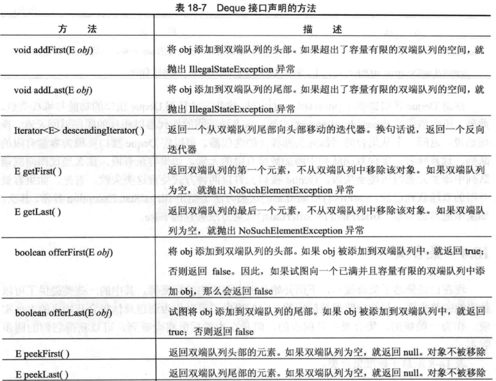

# Java集合

## 集合接口

集合框架定义了一些核心接口，核心接口是集合类的本质特性，而具体类提供了标准接口的不同实现。

|     接口     |                             描述                             |
| :----------: | :----------------------------------------------------------: |
|  Collection  |           允许操作一组对象，位于集合层次结构的顶部           |
|    Deque     |                   扩展Queue以处理双端队列                    |
|     List     |             扩展Collection以处理序列（对象列表）             |
| NavigableSet |          扩展SortedSet以基于最接近匹配原则检索元素           |
|    Queue     | 扩展Collection以处理特殊类型的列表，这种类型的列表只能从列表顶部删除元素 |
|     Set      |        扩展Collection以处理集合，集合中的元素必须唯一        |
|  SortedSet   |                  扩展Set以处理已排序的集合                   |

除了集合接口外，集合还使用了Comparator、RandomAccess、Iterator以及ListIterator接口。从JDK 8 开始，还使用了Spliterator接口。

- Comparator：定义了如何比较两个对象；
- Iterator、ListIterator和Spliterator：枚举集合中的对象；
- RandomAccess：表明列表支持高效、随机的元素访问；

为了提供最大的灵活性，集合接口允许某些方法是可选的。可选方法允许修改集合的内容。支持这些方法的集合被称为是**可修改的**，不允许修改内容的集合被称为**不可修改集合**，当试图在不可修改的集合上使用这些方法，就会抛出UnsupportOperationException异常。所有内置集合都是可修改的。

### Collection接口

Collection 接口是集合框架的基础，因为定义集合的所有类都必须实现该接口。

`interface Collection<E>`

E指定了集合将要存储的对象的类型，Collection扩展了Iterator接口，意味着所有的集合都可以使用for-each风格的for循环进行遍历（只有实现了Iterator接口的类才能通过for循环进行遍历）。

异常：

1. 集合不能被修改，可能发生UnsupportedOperationException;
2. 试图将一个不兼容的对象加入集合，产生ClassCastException；
3. 试图将不允许存储null对象的集合中存储null对象，抛出NullPointerException；
4. 使用的参数无效，抛出IllegalArgumentException；
5. 试图为长度固定且已经满了的集合添加元素，抛出IllegalStateException；

方法：

### List接口

List接口扩展了Collection，并且申明了用来存储一连串元素的集合的行为。在列表中，可以使用从0开始的索引，通过元素的位置插入或访问元素。列表可以包含重复的元素。List接口为泛型接口：`interface List<E>`

异常：

1. 列表不能被修改，可能发生UnsupportedOperationException;
2. 试图将一个不兼容的对象加入列表，产生ClassCastException；
3. 试图将不允许存储null对象的列表中存储null对象，抛出NullPointerException；
4. 使用的参数无效，抛出IllegalArgumentException；
5. 索引无效，一些方法会抛出IndexOutOfBoundsException；

### Set接口

Set方法定义了组（set），扩展了Collection接口，并且申明了集合中不允许由重复元素的组行为。为Set添加重复元素，add() 方法会返回false。Set接口没有定义自己的其他方法。`interface Set<E>`

### SortedSet接口

SortedSet扩展了Set接口，并且声明了以升序进行排列的组行为。`interface SortedSet<E>`。

异常抛出：

1. 调用组中没有包含条目，抛出NoSuchElementException异常；
2. 对象和组中元素不兼容，抛出ClassCastException；
3. 为不允许存储为null对象的组添加null对象，抛出NullPointerException；
4. 使用的参数无效，抛出IllegalArgumentException；

方法：

### NavigableSet接口

NavigableSet扩展了SortedSet接口，并且该接口声明了支持基于最接近匹配原则检查元素的集合行为。`interface NavigableSet<E>`

异常抛出：

1. 对象与组中元素不兼容，抛出ClassCastException；
2. 在不允许存储null对象的组中使用null对象，抛出NullPointerException；
3. 使用参数无效，抛出IllegalArgumentException；

方法：

### Queue接口

扩展了Collection接口，声明了队列的行为，队列通常是先进先出的列表。

`interface Queue<T>`

异常：

1. 试图将一个不兼容的对象加入队列，产生ClassCastException；
2. 试图将不允许存储null对象的队列中存储null对象，抛出NullPointerException；
3. 使用的参数无效，抛出IllegalArgumentException；
4. 试图向长度固定并且已满的队列中添加元素，抛出IllegalStateException；
5. 从空队列中移除元素，抛出NoSuchElementException；

方法：

### Deque接口

扩展了Queue接口，声明了双端队列的行为。双端队列既可以像标准队列一样先进先出，也可以像堆栈那样后进先出。`interface Deque<T>`

异常：

1. 试图将一个不兼容的对象加入队列，产生ClassCastException；
2. 试图将不允许存储null对象的队列中存储null对象，抛出NullPointerException；
3. 使用的参数无效，抛出IllegalArgumentException；
4. 试图向长度固定并且已满的队列中添加元素，抛出IllegalStateException；
5. 从空队列中移除元素，抛出NoSuchElementException；

方法：

